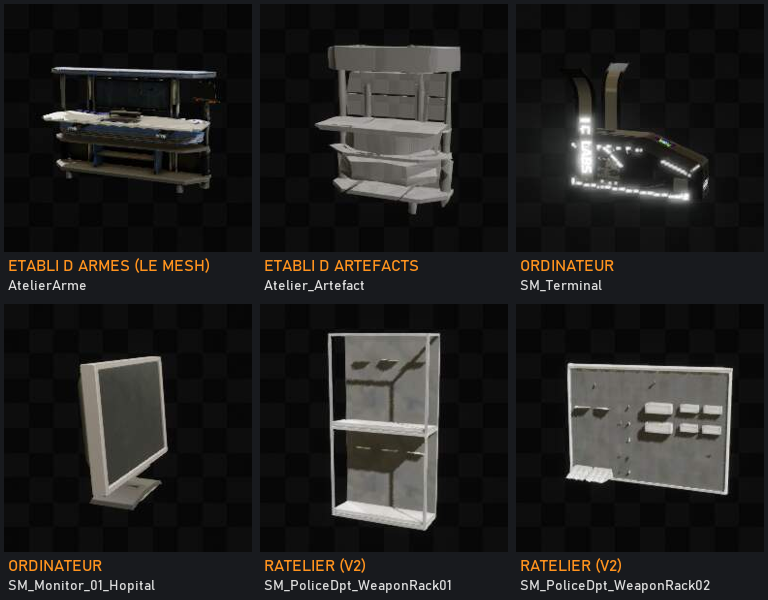

# QMODULE : l'établi d'armes (chantier)

> **Statut : cadrage du 2026-09-23, rien n'est encore construit.** Mesuré sur l'arbre synchronisé ce
> jour (sources de RzZz jusqu'au 22/09 inclus). Ce document fixe ce qui existe, ce qui manque,
> l'ordre des lots et les 4 décisions à prendre avant d'écrire.
> Compagnons : `QMODULE_ARCHITECTURE.md` §15.8 et §15.9 (rack d'arme, premier établi en C++),
> `QMODULE_CATALOGUE_ARMES_VEHICULES.md` §0.5 et §3 (catalogue, pont de stats).
> Ordre fixé par Benja le 2026-08-18 : (1) modules d'armes, (2) **l'établi**, (3) l'interface,
> (4) passe complète sur le fonctionnement. Ce document ouvre le (2).

---

## TL;DR

- **Ce que vit le joueur (façon Metro)** : il interagit avec l'établi, la caméra se pose sur la
  table, **son arme est posée devant lui en 3D**, il passe d'une arme à l'autre ; à côté, **un
  ordinateur** où il monte ses modules et voit l'effet chiffré sur l'arme avant de valider.
- **Le mesh existe déjà : `/Qasset/Props/Construction/Ressources/Meshs/AtelierArme`**, posé en décor
  dans 6 niveaux de jeu. **On le duplique** : l'original reste du décor, intact, et la copie devient
  le mesh d'un **acteur dédié en deux versions** (structure fixée par Benja le 2026-09-23, paragraphe
  1 bis).
- **Une bonne moitié du moteur existe déjà** : l'acteur établi, un écran de modules fonctionnel mais
  brut, les 4 RPC serveur, le rack par exemplaire d'arme, et depuis cette semaine le tir natif de
  RzZz qui **lit déjà** `Damage` et `FireRate` dans le rack de l'arme.
- **Ce qui manque** : la mise en scène (caméra, arme posée, ordinateur), la liste de *toutes* tes
  armes (aujourd'hui seulement les équipées), l'aperçu chiffré par arme, le verrou serveur « il faut
  être à l'établi », l'obtention (QBuilder et points d'intérêt).
- **Avant de construire : 4 mesures (lot 0).** L'inventaire est passé en natif depuis la validation
  du rack d'arme (juillet) ; on vérifie que le rack persiste, qu'un client distant le lit, que les
  dégâts en tiennent compte, et comment l'arme se dessine en 3D.
- **4 décisions pour Benja : paragraphe 5.**

---

## 1. L'expérience visée

1. **Approche** : l'étiquette ancrée « Établi » apparaît sur l'objet (même invite que les coffres,
   règle de `W_InteractFeedback` : invite ancrée quand la cible existe dans le monde).
2. **Interaction** : la caméra quitte le personnage et se pose en fondu sur la table. HUD masqué,
   souris libre. C'est le mécanisme déjà validé sur la fiche cyborg (`SetViewTargetWithBlend`).
3. **La table** : l'arme sélectionnée, en 3D, avec ses pièces montées (canon, crosse, chargeur).
   Rotation à la souris, zoom léger. Arme précédente / suivante au clavier ou par un bandeau.
4. **Les pièces (lot 4)** : étiquettes flottantes ancrées sur les points de montage, comme dans
   Metro ; clic sur une étiquette = choisir une pièce de l'inventaire.
5. **L'ordinateur** : la caméra glisse vers l'écran posé à côté de la table. On y voit les
   emplacements de modules de l'arme, leur niveau, les phases, les modules possédés, et **l'effet
   sur l'arme avant de valider** (dégâts, cadence), comme la fiche cyborg le fait pour le corps.
6. **Échap** : ordinateur, puis table, puis retour au jeu.

---

## 1 bis. Structure fixée par Benja (2026-09-23)

> « On utilise une version dupliquée du mesh et on travaille sur un nouvel acteur dédié : une version
> à mettre dans les levels comme les machines vending, et une version dans le QBuilder pour les
> joueurs. »

Décision complémentaire (Benja, 2026-09-23) : **tout le monde peut utiliser un établi**, y compris
celui construit par un autre joueur.

Les noms et emplacements suivent le précédent maison du **coffre local** (version niveau
`BP_QStorage_LocalChest`, version construction `BP_LocalChest_ForBuild` + entrée `QA_ICLAB_LocalChest`,
ID 14703) :

| Élément | Chemin | Rôle |
|---|---|---|
| Mesh dupliqué | `/Game/GameplayActors/WeaponBench/SM_WeaponBench` | copie de `AtelierArme` ; l'original et ses 14 maps ne bougent pas |
| Version niveau | `/Game/GameplayActors/WeaponBench/BP_WeaponBench` | posée par le level design dans les sous-niveaux QLevel, **comme `BP_Module_Machine`** (mesuré : posée directement dans `Relay_Tower_Djibouti_Recovery_Room` et `EarthICLABRelayA_Garage`, et dans leurs `_LOptimised`). Implémente `Interact_Interface` comme `BP_Shop` : c'est elle qui porte l'interaction, car un enfant ne peut pas redéfinir `InteractClient` (mesuré sur le coffre) |
| Version joueur | `/Game/Systems/QBuilder/Data/ICLAB/Actor/Station/BP_WeaponBench_ForBuild` | **enfant** de `BP_WeaponBench`, sans graphe à lui |
| Entrée de construction | `Actor/Station/QA_ICLAB_WeaponBench` + `Build/Station/QDD_ICLAB_WeaponBench` + inscription au `QTS_ICLAB` (catégorie Station, celle de `QA_ICLAB_Matter_Station`) | recette mesurée du coffre : ID `int32` unique dans `QBuilder_Qanga_ActorData.InputData`, `Data_ID` unique dans le QDD (sinon il écrase l'original en silence), sauvegarde des catalogues avant |
| Logique commune | `AQModule_WorkbenchActor` (C++, QModule) | la classe existe déjà et aucun niveau ne l'utilise : elle devient la base des deux BP (session, caméras, ancre d'arme, verrou serveur). Pas de deuxième classe C++ en doublon. |

L'ancien `QBD_QModule_Workbench` (prototype de juillet, inscrit nulle part) n'est ni utilisé ni
supprimé.

---

## 2. Ce qui existe (mesuré le 2026-09-23)

| Brique | État réel | Où |
|---|---|---|
| Acteur établi | Répliqué, mesh + zone d'interaction, portée 350 cm, `QMOD_OpenWorkbench(PC)`, pertinence réseau 5 km. **Mesh vide, pas branché à l'interaction maison.** | `Plugins/QModule/.../QModule_WorkbenchActor.h` |
| Écran de modules | Natif, 3 colonnes (équipement, rack, modules possédés), fonctionnel mais brut. **Ne liste que les objets équipés.** Domaine Arme en dur. | `QModule_WorkbenchWidgetBase.cpp:285` et `:425` |
| Canal serveur | 4 RPC `SV_Item_InstallModule / RemoveModule / InsertPhase / RemovePhase` qui délèguent à `QModuleItemRack`. **Aucun contrôle de présence à l'établi** : un client peut les appeler de n'importe où. | `QModule_RackComponent.cpp:1078` |
| Rack d'arme | Par exemplaire, clé `QMODRack` du DataObject de l'item, pas d'adjacence, phases prises dans la réserve (`InsertPhaseFromWallet`). | `QModule_ItemRack.h` |
| Effet en jeu | Le tir natif de RzZz compose `Damage` et `FireRate` depuis le rack de l'exemplaire exact. `Range`, munitions et rechargement pas encore lus. | `QangaWeaponContextLibrary.cpp:334` |
| Inventaire | Natif (RzZz) : `IQInventoryAccess` lit sac + équipement et change une pièce montée (`ChangeInventoryAttachment`) dans une transaction. QModule le consomme déjà. | `QInventoryAccess.h`, `QModule_InventoryBridge.h` |
| Pièces d'arme | Natives : `UQItemAttachmentComponent` réconcilie les pièces, **leur apparition est décidée côté serveur**. L'UI actuelle vit dans l'inventaire (`W_AttachmentsSlots`) et reste en place. | `QItemAttachmentComponent.h` |
| Caméra « vraie vue » | Brique `W_ActorViewDisplay` / `ActorViewStand` : avec `UseSceneCapure2d=False` elle prend la vraie caméra du joueur. Validée sur la fiche cyborg (05/09). | mémoire fiche cyborg |
| Interaction maison | `/Game/Systems/Interact/` : `Interact_Interface` (Interact, InteractClient, InteractServer, HasInteraction, IsHoldInteract...) et le composant `Interactive_StaticMesh` (dispatcher `ClientInteractReceived`). | lu dans les `.uasset` |
| QBuilder | `QBD_QModule_Workbench` existe et pointe l'acteur, **mais n'est inscrit nulle part** : l'établi n'est pas dans le menu de construction. | `Content/Phases/QModuleV2/` |
| Points d'intérêt | Les sous-niveaux QLevel sont aussi chargés par le serveur dédié (acteurs spawnés, proxys visuels sautés). Le loot de modules se pose déjà par ancres déterministes identiques serveur/client. | `QModuleLoot_World_SubSystem.h` |
| Tutoriel | Q006 a déjà un **établi de décor** : « Examinez les trois prototypes sur l'établi ». Le tutoriel `L_ICLABS_TUTOV2` contient `AtelierArme` : candidat naturel pour le premier établi fonctionnel du joueur (à confirmer en éditeur : que ce soit bien cette table-là). | `Localization/Game/fr/Game.po` |

### Le mesh de l'établi : `AtelierArme` (désigné par Benja le 2026-09-23)

`/Qasset/Props/Construction/Ressources/Meshs/AtelierArme` (modifié le 2026-07-09), matériaux
`M_Atelierdarmes_01` à `05` dans `Props/Construction/Ressources/Materials/`. Long établi à panneau
arrière, deux étagères, étau sur le côté droit. Il n'a pas de préfixe `SM_`, ce qui l'a caché à ma
première recherche.

**Où il est posé aujourd'hui (scan des 3 509 maps, octets, 2026-09-23)** : 14 maps, dont ces niveaux
de jeu :

| Niveau | Nature |
|---|---|
| `Maps/DevMap/ConstructionLevel/HISTOIRE/L_ICLABS_TUTOV2` | tutoriel ICLAB V2 |
| `Maps/SpawnAreaLab/L_Introduction` | introduction |
| `_QLevel/.../MoonICLABStation/Block/MoonICLABStation_Block_A4` (+ `_LOptimised`) | point d'intérêt QLevel, station lunaire ICLAB |
| `_QLevel/.../YellowWall/SUB_LEVEL/Complex/L_Int_Complex_MiddleTower` (et `MiddleTower1`) | point d'intérêt QLevel, Capitale |
| `Maps/CompositeUniverse/Sous_Levels/L_Int_Complex_MiddleTower` | même lieu, version composite |
| `Qasset/Maps/BattleRoyale/L_Starkitown` | carte Battle Royale |

Le reste : les deux palettes de level design, une map de station lunaire de construction, et trois
maps de backup ou de corbeille. **Aucun asset QBuilder ne le référence** (scan de `QBuilder`,
`Systems`, `Phases`, `_QData`) : il n'existe que comme décor.

Son voisin de dossier `Atelier_Artefact` (posé dans le Gold Shop de la Capitale et les palettes) est
le candidat naturel d'un futur établi d'artefacts ; hors périmètre ici.

### Autres assets à réemployer

| Rôle | Candidats (vignettes lues dans les `.uasset`) |
|---|---|
| Ordinateur à côté de l'établi | `/Game/GameplayActors/TerminalGate/SM_Terminal` (marqué **IC LABS**, le fabricant des modules dans le lore), `SM_Monitor_01_Hopital` |
| Râtelier mural (V2 : toutes tes armes en 3D au mur) | `/Qasset/Props/Inside/Police/SM_PoliceDpt_WeaponRack01` et `02` |

---

## 3. Lot 0 : quatre mesures avant de construire

Le rack d'arme a été validé en juillet sur l'ancien inventaire Blueprint, en PIE solo. Depuis, RzZz a
passé l'inventaire, les pièces et le tir en natif (environ 200 fichiers modifiés depuis le 18/09).
Tant que ces points ne sont pas mesurés, tout ce qu'on pose dessus est à risque.

| # | Question | Pourquoi c'est un doute | Mesure |
|---|---|---|---|
| M1 | Le rack d'une arme survit-il à un redémarrage ? | `QMODRack` est écrit dans le DataObject **hors** transaction d'inventaire ; la persistance native pourrait restaurer l'item sans cette clé. | Installer un module, redémarrer la session, relire (`qmodule.Test.Weapon.Dump`). |
| M2 | Un client distant lit-il le rack de son arme ? | En PIE solo le client est le serveur. Les pièces ont une propriété répliquée dédiée (`RepSlotAttachments`), le rack n'en a pas. L'écran de l'ordinateur tourne chez le client. | PIE 2 joueurs : installer côté client, relire côté client. |
| M3 | Les dégâts réels changent-ils ? | Le pont est écrit dans `ResolveFireContext`, mais je n'ai pas trouvé son appelant : je n'ai pas pu vérifier quelles armes passent par là. | Tirer avec et sans `CanonRenforce`, comparer les dégâts. |
| M4 | Comment l'arme se dessine en 3D ? | Un ItemScript spawné nu est vide (mesuré pour le codex) : le visuel vient de la chaîne d'équipement ou de drop, et les pièces sont posées par le serveur. C'est ce qui tranche la décision D1. | Observer une arme équipée et une arme au sol en PIE, relever qui ajoute les meshes. |

---

## 4. Les lots

| Lot | Contenu | Touche | Garde-fou |
|---|---|---|---|
| 0 | Mesures M1 à M4 | rien (tests sur `L_Dev_Claude`) | aucun risque |
| 1 | **L'établi mis en scène** : ancre d'arme sur la table, caméra table + caméra ordinateur, session d'établi (entrée, sortie, HUD, souris, Échap), branchement `Interactive_StaticMesh`, verrou serveur (D4) | `QModule_WorkbenchActor` (C++), `SM_WeaponBench`, `BP_WeaponBench` et `BP_WeaponBench_ForBuild` (paragraphe 1 bis), essais sur `L_Dev_Claude`. **C++ appliqué et compilé vert le 2026-09-23 à 15h37** (cold build QangaEditor, 9 actions, QModule seul) ; retour arrière possible par `Saved/WeaponBench_Patch_20260923/REVERT.ps1` (contrôle md5) | QModule : jamais de Live Coding, rebuild à froid |
| 2 | **L'arme sur la table** (selon D1) et sélection parmi toutes les armes possédées (D3). **Exigence Benja du 2026-09-23 : toutes les armes actuelles, telles qu'elles sont assemblées en jeu** (AK47, AT56, FA62, MZ56, Shotgun, Sniper, les 6 NASH V1, les 8 NashV2, Recycler...), sans système de pièces pour l'instant ; le montage pièce par pièce du NASH V1 (corps + pièces greffées) viendra plus tard | QModule C++ | le visuel d'arme appartient au chantier de RzZz : uniquement ses API publiques ; réutiliser la chaîne qui dessine déjà chaque arme, jamais un rendu parallèle par arme |
| 3 | **L'ordinateur** : l'écran de modules rhabillé avec les briques validées du Mur (cellules, carte de survol, glisser-déposer, sons) ; aperçu chiffré par arme (neuf : détail et aperçu de stat pour un rack d'exemplaire) ; rafraîchissement sur événement, pas de minuterie | QModule C++ + un WBP | le Mur n'est pas modifié, ses briques sont réutilisées |
| 4 | **Les pièces façon Metro** sur la table | QModule C++, qui appelle `ChangeInventoryAttachment` natif | l'UI pièces de l'inventaire reste en place |
| 5 | **Obtention** (structure du paragraphe 1 bis) : (a) version joueur : `QA_ICLAB_WeaponBench` + `QDD_ICLAB_WeaponBench` + `QTS_ICLAB`, fantôme = mesh dupliqué, coûts ; (b) version niveau : `BP_WeaponBench` posé par le level design dans les points d'intérêt choisis, comme les distributeurs | catalogues QBuilder, niveaux choisis | catalogues sauvegardés avant, comptes vérifiés avant et après |
| 6 | **Habillage** : ordinateur posé à côté, sons, textes en String Table | assets | |

Chaque lot se termine par une validation en jeu sur `L_Dev_Claude` et une note ici.

---

## 5. Décisions pour Benja

**D1. L'arme sur la table : vue par tous, ou par toi seul ?**
- (a) *Recommandé* : le serveur pose l'arme sur la table et les autres joueurs la voient. On
  réutilise toute la chaîne de visuel existante, **pièces comprises**. Un joueur par établi à la fois.
- (b) Copie locale chez le joueur : plusieurs joueurs sur le même établi, mais les pièces sont posées
  par le serveur ; une copie locale n'aurait pas les pièces sans refaire leur logique.

**D2. L'ordinateur : widget 3D sur l'écran, ou panneau calé sur la dalle ?**
- (a) *Recommandé* : la caméra cadre le moniteur et le panneau se cale exactement sur sa dalle. Même
  rendu à l'œil, et le glisser-déposer du Mur marche tel quel.
- (b) Widget 3D sur le moniteur : plus « vrai », mais la souris passe par un composant
  d'interaction, fragile pour le glisser-déposer.

**D3. Quelles armes à l'établi ?**
*Recommandé* : toutes celles que tu possèdes (sac + équipées). Le serveur l'accepte déjà
(`PawnOwnsInstance` = sac ou équipé), seul l'écran filtre aujourd'hui.

**D4. Monter un module sans établi ?**
Aujourd'hui c'est possible, les RPC ne vérifient rien. *Recommandé* : le serveur refuse hors d'un
établi, sinon l'établi n'est qu'un raccourci.

---

## 6. Coordination avec RzZz

- `QInventory`, `QInventoryIntegration` et `QWeapon` sont ses chantiers actifs (sources modifiées
  jusqu'au 22/09 22:38). L'établi ne s'y branche que par leurs API publiques (`IQInventoryAccess`,
  `ChangeInventoryAttachment`, `ResolveFireContext`).
- Toute modification nécessaire dans ses plugins (par exemple lire `Range` dans `ResolveFireContext`)
  lui est proposée en patch sous `Saved/`, jamais écrite dans l'arbre synchronisé.
- Le C++ de QModule part chez lui par Syncthing dès l'écriture : chaque lot est compilé vert ici avant
  d'être considéré livré.

---

## 7. Ce que je n'ai pas pu vérifier

- L'appelant de `ResolveFireContext` (M3).
- Le comportement d'un acteur **répliqué** posé dans un sous-niveau QLevel (établi de point
  d'intérêt) : serveur et client chargent chacun le sous-niveau, il faut vérifier qu'on n'obtient pas
  deux établis. À mesurer avant le lot 5.
- Les réglages réseau de `BP_Shop` (répliqué ou non) quand il est posé dans un sous-niveau QLevel : la
  version niveau doit faire exactement pareil, à lire en éditeur avant de la créer.
- La taille exacte du mesh (bornes) : elle fixe l'ancre de l'arme et les deux cadrages caméra.
- Tout ce qui demande l'éditeur (M1 à M4) : il n'a pas été lancé pour ce cadrage.
