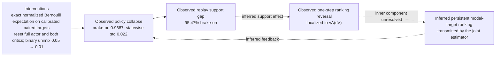

# DreamerV3 Mixed-Action Brake Collapse

## Consolidated diagnosis, correction, and falsification plan

**Status:** Consolidated research report, 2026-07-21  
**Case:** Hovercraft policy with continuous throttle/steering and Bernoulli boost/brake heads  
**Failed-run baseline:** 1,347,193 environment steps, 7,672 learner updates, 0 successes in 341 completed episodes  
**Primary implementation reference:** official `danijar/dreamerv3` commit `e3f02248693a79dc8b0ebd62c93683888ddaccfe`  
**Primary paper copy:** [local arXiv v2 PDF](../2301.04104v2.pdf), SHA-256 `D0385798E8BADA8E81B915C1743BE81D9CE8776F12ED937E09351995E099CE37`

This is the single authoritative synthesis of the material formerly collected in `Pending_Research`. It consolidates the eight reviewed report chapters, four deep-research streams, the independent source-verification gate, three editorial reviews, and adversarial analyses from ChatGPT 5.6 SOL Pro, Gemini 3.5 Flash, and Claude Opus 4.8 Max. Where those sources disagreed, this report resolves the disagreement instead of reproducing mutually incompatible recommendations. After successful consolidation and validation, redundant source files and figures were removed; the original paper was retained one directory above, and every retained figure datum is reproduced in this file's tables or diagrams.

**Evidence rule.** Measured run telemetry and matched probes outrank model consensus. Pinned primary code and the local paper outrank recollection from older Dreamer generations or unofficial ports. Mathematical conclusions apply only under their stated assumptions. Mechanistic interpretations that exceed those facts remain labeled as inferences.

**Scope boundary.** This artifact consolidates research and a falsifiable implementation plan; it does not claim that the proposed counterfactual estimator, recovery loader, or runtime gates are already implemented. Statements about the inspected local code are explicitly dated and distinguish present behavior from the failed-run report.

### Decision summary

- **Localized failure:** the measured one-step brake-on ranking reversal enters through the continuation-weighted bootstrap product $\gamma\hat c\hat V$, not through the immediate reward prediction. The existing probe does **not** separate continuation error, successor-latent/dynamics error, and critic-value error inside that product; critic extrapolation is the leading intervention hypothesis, not a proven component attribution.
- **Primary testable correction:** replace the boost and brake coordinates of joint REINFORCE with the exact unimix-Bernoulli expectation gradient, using common-random-number paired $k$-step counterfactual return differences for $k\in[5,15]$ (provisional default 15), divided by the same detached return scale $S$ as the continuous advantage. Estimate this potential on a uniform subsample of imagined decision points to bound compute. Keep continuous-head REINFORCE unchanged and remove binary log-probabilities from its sum. This is variance reduction, not a sign repair: every supplied $k\ge5$ **mean** remains pro-brake, so the target is allowed to train only behind the model/real calibration gates.
- **Required state surgery:** reset the fast and slow critics and the **full actor plus actor optimizer**. The local actor is one shared MLP, so retaining only continuous heads is not an implementable clean separation. Retain the world model, reward and continuation heads, replay, and return normalizer provisionally, subject to held-out calibration and the falsification gates below.
- **Coverage recovery:** use a dedicated actor binary unimix $u=0.05$ initially, then decay to $0.01$ only on measured exit criteria. Here $u=0.05$ means a $u/2=2.5\%$ minimum probability per binary outcome; it is not the same parameterization as an adversarial proposal to clamp each outcome at $10\%$ (equivalent to $u=0.20$).
- **No reward change now:** the learned-model probe suggests state-selective braking but cannot decide real-MDP optimality. Reward changes remain an escalation path only if estimator/model calibration succeeds and completion still fails.

### Adversarial research reconciliation

| Disputed point | Adversarial position(s) | Consolidated resolution | Status |
|---|---|---|---|
| Current official continuous-action estimator | Gemini and one older Claude draft called pathwise/dynamics backpropagation the current official default. | Rejected as version-stale. The local arXiv v2 paper states that REINFORCE is used for both discrete and continuous actions, and pinned current code implements the same score-function surrogate for every action key. The pathwise claim belongs to arXiv v1 and older unofficial ports. | **Verified** |
| Entropy coefficient | One Claude draft asserted `1e-3`; the other analyses and Kimi found `3e-4`. | `3e-4` is authoritative in the local v2 paper, Nature 2025, and pinned config. `1e-3` appears only in a rejected adaptive-entropy ablation range, not as the current actor default. Raising entropy is not the repair. | **Verified** |
| Weighted batch-mean advantage offset | ChatGPT called it non-official but probably harmless; an adversarial Claude derivation warned it can bias the gradient when weights depend on the sampled action; Kimi proved only a tiny shrink under action-independent weights. | The harmlessness result is **conditional**, not universal. In the described loop, $w_t$ is the pre-decision prefix weight stored before multiplying by the continuation caused by $a_t$, so it is independent of the current head action given $s_t$; with a large batch×time pool, only the small finite-batch/correlation effect remains. If an implementation instead includes the current action's continuation in $w_t$, or centers per sequence, the adversarial bias warning applies. The offset is not the diagnosed cause, but removing it matches official behavior and removes this unnecessary precondition. | **Conditionally resolved** |
| One-step versus multi-step counterfactual target | Claude favored one-step $r+\gamma cV$ for low cost and less model exploitation; ChatGPT and the detailed Claude draft favored forced-first-action multi-step returns; Kimi chose paired $k\in[5,15]$. | One-step remains a diagnostic because its pro-brake reversal lies in the unresolved $\gamma\Delta(\hat c\hat V)$ product. CRN-paired $k\in[5,15]$ is the provisional training target because the model-sweep median stabilizes there, but continuation/dynamics/value attribution and real-MDP validity still require calibration. | **Target selected; cause unresolved** |
| Reward trap and uncapped no-progress penalty | Gemini recommended uncapping the penalty immediately; Claude treated a reward change as likely; ChatGPT deferred it. | Always-brake remains mathematically plausible. The learned-model $k\ge5$ medians suggest brake-off in a typical probed state while positive means expose an unresolved dangerous tail; neither statistic proves the real-MDP optimum. No brake penalty or no-progress rewrite is made now. Potential-based progress shaping or a bounded/lexicographic reward review is allowed only through Escalation C after model/estimator calibration and persistent non-completion. | **Unresolved; change deferred** |
| Exploration floor magnitude | Proposals ranged from a $10\%$ outcome clamp (`u=0.20`) to `u=0.10`; Kimi selected `u=0.05`. | Start at `u=0.05`. The inspected constructor does **not** reset to $p=0.5$: configured boost-on and brake-on probabilities are both 0.05. That brake-off-rich start supplies fresh off-branch data; the floor then limits renewed collapse without permanently imposing a 10% clamp. If coverage or calibration gates fail, escalate deliberately to `u=0.10`, then at most `u=0.20`; do not conflate clamp $\epsilon$ with unimix $u$. | **Engineering choice, gated** |
| Clear/rebalance replay | ChatGPT and Gemini favored clearing or isolating replay; Claude varied between clearing and rebalancing; Kimi retained it. | Retain the truthful buffer: it contains about 11,000 brake-off transitions and valuable real dynamics, and clearing it does not repair the estimator or critic. Re-ground with fresh post-reset exploration; optional rare brake-off oversampling is limited to critic fine-tuning. Raw action-conditioned replay rewards remain prohibited as causal evidence. | **Retain with support gate** |
| Reset return/advantage normalizers | All adversarial drafts recommended reset; Kimi retained the return normalizer. | Retain the percentile return-scale EMA: it is a positive divisor with a lower bound of 1 and cannot flip action ordering. The official advantage normalizer is identity, so there is no learned advantage state to preserve. Reset only on a demonstrated invalid state (NaN, non-positive/degenerate implementation, or incompatible checkpoint schema), not because the policy collapsed. | **Retain, monitor** |
| Retain world model and reward head | Gemini retained only the world model; some Claude text called world-model retention unsafe and reward EV too weak; Kimi retained both. | Retain the world model, reward head, and continuation head **provisionally** because they are supervised on real replay, but do not call them accurate: the reward probe only shows that its predictions are not majority pro-brake, and EV is low. Held-out calibration, support, decomposition ablations, and the authoritative real-environment branch test gate their use in the $k$-step target. | **Retain provisionally** |
| Reset full actor versus binary heads only | Adversarial drafts usually reset the entire actor; Kimi resets only Bernoulli heads when separable. | Reset the full actor and actor optimizer in the inspected local architecture: all four outputs share one MLP/trunk, so a clean binary-only checkpoint boundary does not exist. A future physically separated architecture could retain continuous modules through explicit keys, but that is not this checkpoint. | **Full reset for current architecture** |
| Model-only versus real-environment calibration | ChatGPT and Gemini asked for real paired interventions; the chapter set relied mainly on matched model probes and online outcomes. | Add an authoritative Unreal paired-state intervention test when exact simulator-state and RNG restoration are available. It compares model and real on/off signs from identical states. If exact restoration is unavailable, fail that test explicitly; do not substitute confounded unpaired episodes. | **Added falsifier** |

### Reading map

1. Root-cause verdict and epistemic tiers
2. Source-backed comparison with official DreamerV3
3. Policy-gradient derivations and Q-target analysis
4. Primary correction and state-retention decision
5. PyTorch implementation outline
6. Focused falsification tests
7. Unreal runtime acceptance metrics
8. Primary sources and inference registry

## 1. Root-cause verdict

This report diagnoses one failure — a DreamerV3 hovercraft agent whose brake head collapsed to near-always-on over 1,347,193 environment steps and 7,672 learner updates, with zero successes in 341 completed episodes — and derives one correction. This opening chapter is the verdict a time-constrained expert reads first. It separates three tiers of knowledge: facts established by the run data and matched counterfactual probe (section 1.1), inferences that organize those facts into a candidate mechanism (section 1.2), and unresolved hypotheses the current evidence cannot decide (section 1.3). It then states what can and cannot be concluded about whether the staged reward makes always-brake optimal (section 1.4, Q11) and ends with a pointer to the correction. Every number is traceable to the user's telemetry, the 2,048-state probe, or the pinned official sources of section 2.

**Verdict.** The failure signature is a self-reinforcing support/credit loop, with one component boundary proven and the inner attribution unresolved: (i) the policy and replay are both near always-brake (95.47% brake-on in replay); (ii) the immediate reward prediction is usually anti-brake, yet the one-step bootstrapped estimate reverses to pro-brake; therefore the reversal lies in $\gamma\Delta(\hat c\hat V)$, the difference of the two continuation-weighted successor-value products; (iii) the joint scalar-advantage REINFORCE estimator is valid for its model target but needlessly high-variance for a binary head and can transmit any persistent ranking error broadly; (iv) saturation reduces the unimix-Bernoulli learning lever to $\partial p/\partial z=0.0255$. The probe does **not** prove whether continuation, successor dynamics/latents, or critic value causes the bootstrap-product reversal, and it does not prove the real reward optimum. It does clear indexing and the disputed entropy constant: indexing matches official, and $3\times10^{-4}$ is the current official value in [code](https://github.com/danijar/dreamerv3/blob/e3f02248693a79dc8b0ebd62c93683888ddaccfe/dreamerv3/configs.yaml#L108) and [papers](https://www.nature.com/articles/s41586-025-08744-2).

### 1.1 Tier 1 — proven facts

| # | Established fact | Where established |
|---|---|---|
| F1 | Collapse observed: imagined brake-on rate 0.9687; policy brake-on probability 0.9688 (mapped mean 0.9376); statewise std of the mapped brake mean 0.02197 | Run telemetry (user's run data) |
| F2 | Replay support deficiency: 95.47% brake-on over 249,767 records (334 episodes); episode-order quartiles 94.53 / 95.33 / 96.21 / 95.83% — the deficit is durable, not transient | Replay audit (user's run data) |
| F3 | Immediate reward predictions are not majority pro-brake: brake-on ranks better in only 29.4% of states; $\Delta\hat r$ mean $-0.00157$, median $-0.00141$. This is a ranking fact, not an accuracy certificate. | Counterfactual probe, 2,048 states; Thm. 5.4, item 1, section 3 |
| F4 | One-step bootstrapped Q pro-on: 62.2% on-better; $\Delta\hat Q_1$ mean $+0.0609$, median $+0.0164$ | Same probe; section 3 |
| F5 | Exact pointwise $k=1$ decomposition: $\Delta\hat b_1\equiv\Delta\hat Q_1-\Delta\hat r=\gamma[\hat c_{\rm on}\hat V_{\rm on}-\hat c_{\rm off}\hat V_{\rm off}]$. Linearity makes the **mean** $+0.0625$; $+0.0178$ is only the difference of two reported medians, not the unreported median of $\Delta\hat b_1$. | Thm. 5.4, item 2, section 3 |
| F6 | Target sensitivity: paired-rollout medians become negative for $k\ge5$ ($-0.0049$ to $-0.0130$) and remain so through $k=30$, while means remain positive ($+0.039$ to $+0.074$). This does not identify which learned component is wrong. | Paired rollouts (user's probe); Thm. 5.4, item 3, section 3 |
| F7 | Official-config matches: entropy $\eta=3\times10^{-4}$ current ([configs.yaml L108](https://github.com/danijar/dreamerv3/blob/e3f02248693a79dc8b0ebd62c93683888ddaccfe/dreamerv3/configs.yaml#L108), [arXiv v2 Table 4](https://arxiv.org/pdf/2301.04104), [Nature 2025 EDT5](https://www.nature.com/articles/s41586-025-08744-2/tables/5)); advantage normalizer default `none` = identity ([configs.yaml L113](https://github.com/danijar/dreamerv3/blob/e3f02248693a79dc8b0ebd62c93683888ddaccfe/dreamerv3/configs.yaml#L113)); REINFORCE for all heads ([agent.py L411–414](https://github.com/danijar/dreamerv3/blob/e3f02248693a79dc8b0ebd62c93683888ddaccfe/dreamerv3/agent.py#L411-L414)); indexing matches official, no off-by-one ([driver.py L56–79](https://github.com/danijar/dreamerv3/blob/e3f02248693a79dc8b0ebd62c93683888ddaccfe/embodied/core/driver.py#L56-L79)) | Section 2 sources |

The probative weight sits in F3–F6. On the same 2,048 states, the immediate reward prediction is usually anti-brake while the one-step bootstrapped estimate is usually pro-brake. Pointwise, their difference is the continuation-weighted bootstrap product $\Delta\hat b_1=\gamma\Delta(\hat c\hat V)$, so the ranking reversal lies beyond the immediate reward term. That boundary is exact; the next decomposition is not available. $\Delta(\hat c\hat V)$ can change because $\hat c$ differs, because the forced action moves the RSSM to a different successor latent, because $\hat V$ is wrong there, or because several terms interact. The $k$-sweep shows strong target/horizon sensitivity but cannot exonerate dynamics merely because the same learned model generated every branch. F7 clears a narrower configuration layer: the entropy coefficient and indexing match current official DreamerV3; the joint estimator form is official but remains a variance concern. The batch-mean advantage offset is not a credible cause **under the reported pre-decision prefix-weight indexing**, though that conclusion remains conditional as specified in section 3. Component causality and real-MDP validity therefore remain tier-2/tier-3 questions.

### 1.2 Tier 2 — high-confidence inferences: the self-confirming loop



The loop's nine links and their epistemic status are consolidated below:

| Link | Claim | Status |
|---|---|---|
| L1 | Policy collapsed: imagined brake-on 0.9687, statewise std 0.022 | **Observed** |
| L2 | Replay support deficient: 95.47% brake-on ⇒ ≈4.5% (≈11k) off-transitions | **Observed** (counting fact) |
| L3 | Immediate reward predictions are not majority pro-brake (29.4% on-better); their real-reward accuracy is unproven | **Observed probe ranking** (Thm. 5.4, item 1) |
| L4 | The pro-brake one-step reversal lies in $\Delta\hat b_1=\gamma\Delta(\hat c\hat V)$; mean $+0.0625$ | **Proven decomposition** (Thm. 5.4, item 2) |
| L5 | Continuation, successor dynamics/latent state, and critic value contributions inside $\Delta(\hat c\hat V)$ | **Unresolved**; requires ablation and/or authoritative paired Unreal intervention |
| L6 | Critic extrapolation caused by off-support data is the dominant inner component | **Inferred intervention hypothesis** |
| L7 | Drift ratchet: the joint estimator transmits a persistent pro-brake model-target ranking while replay loses brake-off support | **Inferred mechanism**, observed direction |
| L8 | State-independence (std 0.022) as the signature of a state-independent bias integrating on all logits | **Inferred** (Prop. 1.7) |
| L9 | Feedback closes into replay: imagination (96.87%) sits ahead of replay (95.47%) | **Observed direction** |

Four inferences carry the mechanism beyond the proven links. First, state-independence is consistent with an integrated common ranking error (Prop. 1.7, section 3), but the observed std $0.022$ does not uniquely identify that mechanism. Second, exact Bernoulli marginalization removes own-action sampling variance; it does **not** remove model-target bias, so estimator surgery must be paired with model/critic calibration rather than treated as a cure by itself. Third, the replay holds $\approx$250k transitions against the official $5\times10^{6}$ ([arXiv v2, Table 4](https://arxiv.org/pdf/2301.04104)); we infer — not prove — that the smaller buffer hastened off-support loss. Fourth, self-repair is mechanically weak near saturation: at $z=3.6$, $\partial p/\partial z=0.0255$, roughly tenfold below its maximum, and about 62% of 15-step rollouts contain no brake-off step at all at the observed executed brake-off rate. The earlier research's numeric SNR and entropy-versus-"true-gap" ratios are not retained as facts because they substituted the immediate reward-head gap for the unmeasured full counterfactual action-value gap.

### 1.3 Tier 3 — unresolved hypotheses

Three questions remain genuinely open; none blocks the correction, but each has a named falsifier.

- **H1 — extrapolation causality vs self-consistent $V^{\pi}$.** L6 could equally read as a *correct* $V^{\pi_{\mathrm{collapsed}}}$ evaluated on the collapsed visitation distribution: both produce the observed pro-on sign, and the probe cannot separate them (the $k\ge5$ median flip shows only that the bootstrap is inconsistent with longer model consequences). The discriminating test is a critic reset under a healthy exploration floor: if a retrained $\hat V$ re-acquires the pro-on bias despite adequate off-support, the driver is deeper than support starvation — a reward or model defect. The extrapolation-error mechanism itself is established in the off-policy literature ([Fujimoto et al., BCQ](https://arxiv.org/abs/1812.02900)); its causal role here is not.
- **H2 — dangerous-tail structure.** For $k\ge5$ the means stay positive ($+0.039$ to $+0.074$) while the medians are negative, so the aggregate is dominated by the positive half/tail. The identity, size, and state features of that tail are uncharacterized, and whether it coincides with genuinely hazardous states (as the Q11 inequality predicts) is untested. This matters because the gradient-relevant object is the per-state mean, not the median.
- **H3 — long-horizon model fidelity on the brake-off branch.** With 4.5% replay support, compounding dynamics error on forced-brake-off rollouts plausibly grows beyond $k=30$ (Prop. 6.2.3, section 3); the stable $k\in[5,30]$ medians cannot certify deeper horizons, and no measurement exists there.

### 1.4 Could always-brake be genuinely optimal under the staged reward? (Q11)

**Answer to Q11.** **Not established.** Under a one-step local approximation to the staged reward, brake-on is preferred when its avoided hazard and no-progress effects exceed its progress cost:

$$
\Delta h(s)\,D(s)+\big[\nu(s,{\rm off})-\nu(s,{\rm on})\big]\;>\;\alpha\,\Delta x(s)\,\Phi(s),
$$

Here $\Delta h(s)$ is the local crash-hazard reduction from braking, $D(s)$ the expected crash/termination cost, $\alpha\Delta x(s)$ the progress cost, $\nu$ the action-dependent no-progress contribution, and $\Phi$ a discount factor over the progress delay. This is **not** a necessary-and-sufficient condition for the full partially observed MDP unless delayed transitions, completion, termination, and future policy effects are either included in these terms or assumed equal between branches. If the $\nu$ difference is temporarily ignored and $\Phi\approx1$, the earlier threshold calculation ($\Delta h\gtrsim7\times10^{-6}$/step at $D=200$, $2\times10^{-6}$ at $D=700$ for a $1.4\times10^{-3}$ progress cost) only shows that always-brake is plausible. The learned-model $k\ge5$ medians favor brake-off in a typical sampled state while their positive means reveal a consequential right tail; neither statistic establishes the real-MDP expected $Q$ or its optimum. Therefore the report defers reward edits, keeps the time-cost gate unchanged, and requires the paired Unreal intervention plus post-repair task outcomes before Escalation C may conclude that reward staging—not estimator/model calibration—is binding.

**Escalation C reward-design menu (preserved from the adversarial research; not part of the current correction).** If calibrated real interventions and the full task budget show that the objective itself prefers non-completing brake-heavy behavior, evaluate these in order: (A) a constrained/lexicographic objective with health, completion, and speed represented separately and lower-priority advantages admitted only when higher-priority constraints pass; (B) a small **bounded, health-gated** time cost whose episode maximum cannot outweigh health or completion; or (C) authoritative route-progress potential shaping $F(s,a,s')=\gamma\Phi(s')-\Phi(s)$. Option C preserves the base optimal policy only under the standard potential-shaping assumptions, which must be checked against partial observability, termination, and staged curriculum semantics. None licenses an arbitrary brake penalty or an uncapped stationarity cost.

The primary correction is a single coordinated change, detailed in sections 4–7: replace the two Bernoulli heads' joint-REINFORCE coordinates with the exact Bernoulli-expectation gradient $\nabla_z\mathbb{E}[Q]=(1-u)\,\sigma(1-\sigma)\,\Delta\hat Q$ evaluated on CRN-paired $k$-step counterfactuals (removing the binary log-probs from the joint REINFORCE sum, Thm. 4.4, section 3), reset both critics and the full shared-MLP actor with fresh optimizer state, and hold a dedicated binary unimix floor until the exit criterion of section 7 is met.

## 2. Comparison with official DreamerV3 (source-backed)

### 2.1 Reference sources and method

This section compares the user's PyTorch DreamerV3 implementation — imagined actor update, actor config, replay indexing, and action handling, as reproduced in the run report — against four pinned primary references: the official repository at commit `e3f0224` (dated 2026-05-24, package `dreamer` 3.3.1; JAX-only, zero PyTorch/TensorFlow imports, `embodied` vendored in-tree — [official repo, requirements.txt @e3f0224](https://github.com/danijar/dreamerv3/blob/e3f02248693a79dc8b0ebd62c93683888ddaccfe/requirements.txt), [official repo, setup.py @e3f0224](https://github.com/danijar/dreamerv3/blob/e3f02248693a79dc8b0ebd62c93683888ddaccfe/setup.py)); the local arXiv v2 revision dated 2024-04-17 — [arXiv v2](https://arxiv.org/pdf/2301.04104); Nature 2025 (volume 640, pages 647–653, published 2025-04-02 — [Nature 2025](https://www.nature.com/articles/s41586-025-08744-2)); and arXiv v1 (2023-01-11, used for historical deltas only — [arXiv v1](https://arxiv.org/pdf/2301.04104v1)). The **unofficial** NM512/dreamerv3-torch port (commit `6ef8646`) is used as a secondary reference only: it mirrors the 2023 release (`imag_gradient: 'dynamics'` default, explicit `discount: 0.997`, actor/critic lr 3e-5, grad clip 100), not the current official code, which has no `imag_gradient` option ([NM512/dreamerv3-torch (unofficial), models.py L391–433 @6ef8646](https://github.com/NM512/dreamerv3-torch/blob/6ef8646d807cd10ce0c88e10a7e943211e7fc44c/models.py#L391-L433), [NM512/dreamerv3-torch (unofficial), configs.yaml L50 @6ef8646](https://github.com/NM512/dreamerv3-torch/blob/6ef8646d807cd10ce0c88e10a7e943211e7fc44c/configs.yaml#L50), [official repo, dreamerv3/configs.yaml L88 @e3f0224](https://github.com/danijar/dreamerv3/blob/e3f02248693a79dc8b0ebd62c93683888ddaccfe/dreamerv3/configs.yaml#L88)).

Method: each table row traces one component to exact config keys, code lines, and paper equations or table rows, and closes with a verdict — **match** (identical or functionally equivalent), **immaterial divergence** (hygiene; not collapse-relevant), or **material divergence** (align during the correction, section 4). Terms: REINFORCE is the likelihood-ratio (score-function) estimator; EMA is exponential moving average; *unimix* is a $(1-u)$-prediction plus $u$-uniform mixture; $\mathrm{sg}(\cdot)$ is stop-gradient; AGC is adaptive gradient clipping. Derived claims are labeled "Analysis".

### 2.2 Key official hyperparameters (v2 Table 4 = Nature Extended Data Table 5)

The values below are identical between arXiv v2 Table 4 (p. 21) and Nature 2025 Extended Data Table 5, verified row-by-row against the published table image ([arXiv v2, Table 4](https://arxiv.org/pdf/2301.04104), [Nature 2025, Extended Data Table 5](https://www.nature.com/articles/s41586-025-08744-2/tables/5), [EDT5 table image](https://media.springernature.com/full/springer-static/esm/art%3A10.1038%2Fs41586-025-08744-2/MediaObjects/41586_2025_8744_Tab5_ESM.jpg)).

| Group | Parameter | Value |
|---|---|---|
| General | Replay capacity | $5\times10^{6}$ |
| General | Batch size $B$ / batch length $T$ | 16 / 64 |
| General | Activation | RMSNorm + SiLU |
| General | Learning rate | $4\times10^{-5}$ |
| General | Gradient clipping | AGC(0.3) |
| General | Optimizer | LaProp ($\epsilon=10^{-20}$) |
| World model | Loss scales $\beta_{\mathrm{pred}}$ / $\beta_{\mathrm{dyn}}$ / $\beta_{\mathrm{rep}}$ | 1 / 1 / 0.1 |
| World model | Latent unimix / free nats | 1% / 1 |
| Actor–critic | Imagination horizon $H$ | 15 |
| Actor–critic | Discount horizon $1/(1-\gamma)$ | 333 |
| Actor–critic | Return lambda $\lambda$ | 0.95 |
| Actor–critic | Critic loss scale $\beta_{\mathrm{val}}$ / replay scale $\beta_{\mathrm{repval}}$ | 1 / 0.3 |
| Actor–critic | Critic EMA regularizer / decay | 1 / 0.98 |
| Actor–critic | Actor loss scale $\beta_{\mathrm{pol}}$ | 1 |
| Actor–critic | Actor entropy regularizer $\eta$ | $3\times10^{-4}$ |
| Actor–critic | Actor unimix | 1% |
| Actor–critic | Actor RetNorm scale $S$ / limit $L$ / decay | $\mathrm{Per}(R,95)-\mathrm{Per}(R,5)$ / 1 / 0.99 |

Two properties of this table drive the comparison. First, one row-set is shared across all benchmarks — the caption rules out per-domain tuning, annealing, prioritized replay, weight decay, and dropout ([arXiv v2, Table 4 caption](https://arxiv.org/pdf/2301.04104)) — so a deviation in the user's config is a deliberate local choice. Second, three naming correspondences map the table onto the code: "Critic EMA decay 0.98" is `slowvalue: {rate: 0.02, every: 1}` (EMA weight 0.02 per learner update — [official repo, dreamerv3/configs.yaml L110 @e3f0224](https://github.com/danijar/dreamerv3/blob/e3f02248693a79dc8b0ebd62c93683888ddaccfe/dreamerv3/configs.yaml#L110)); "RetNorm decay 0.99" is the return normalizer's EMA rate 0.01 ([official repo, dreamerv3/configs.yaml L111–113 @e3f0224](https://github.com/danijar/dreamerv3/blob/e3f02248693a79dc8b0ebd62c93683888ddaccfe/dreamerv3/configs.yaml#L111-L113)); "Discount horizon 333" is `horizon: 333` plus `contdisc: True`, not an explicit $\gamma$ key ([official repo, dreamerv3/configs.yaml L104–109 @e3f0224](https://github.com/danijar/dreamerv3/blob/e3f02248693a79dc8b0ebd62c93683888ddaccfe/dreamerv3/configs.yaml#L104-L109)). The "Actor unimix 1%" row is a paper-design statement the default code path does not consume (unimix row below); the comparison table's v1 column tracks the remaining 2023-era values ([arXiv v1, Table W.1](https://arxiv.org/pdf/2301.04104v1)).

### 2.3 Component-by-component comparison

The reference is the current official actor objective, $\mathcal{L}(\theta) \doteq -\sum_{t=1}^{T} \mathrm{sg}((R^{\lambda}_{t} - v_{t})/\max(1, S)) \log \pi_{\theta}(a_{t} \mid s_{t}) + \eta\, \mathrm{H}[\pi_{\theta}(a_{t} \mid s_{t})]$ — identical in arXiv v2 Eq. (6) and Nature 2025 (Actor learning), and implemented in `imag_loss` ([arXiv v2, Eq. (6)](https://arxiv.org/pdf/2301.04104), [Nature 2025, Actor learning](https://www.nature.com/articles/s41586-025-08744-2), [official repo, dreamerv3/agent.py L411–414 @e3f0224](https://github.com/danijar/dreamerv3/blob/e3f02248693a79dc8b0ebd62c93683888ddaccfe/dreamerv3/agent.py#L411-L414)). As printed, the $+\eta\mathrm{H}[\pi]$ term sits outside the negated sum; the intended entropy-bonus reading is how the code implements it. The user's pseudocode implements the same surrogate — one joint log-prob summed over the four heads, one detached scalar advantage, 3e-4 entropy per group — and the table decomposes the comparison line by line; the "User" column quotes the run report verbatim.

| Component | Failed-run implementation (supplied report) | Official current code (e3f0224) | Paper (v2 / Nature 2025) | arXiv v1 2023 | Verdict |
|---|---|---|---|---|---|
| Gradient estimator | Pure REINFORCE for all four heads: $\log\pi_\theta(a_t \mid s_t)\,\mathrm{sg}(A_t)$, rollout under `torch.no_grad()`, features/actions detached; no dynamics backpropagation | REINFORCE for all action types, `logpi * sg(adv_normed)`; **no `imag_gradient` key exists**; `ac_grads: False` keeps actor/critic gradients out of the world model ([official repo, dreamerv3/agent.py L411–414 @e3f0224](https://github.com/danijar/dreamerv3/blob/e3f02248693a79dc8b0ebd62c93683888ddaccfe/dreamerv3/agent.py#L411-L414), [official repo, dreamerv3/agent.py L192–196 @e3f0224](https://github.com/danijar/dreamerv3/blob/e3f02248693a79dc8b0ebd62c93683888ddaccfe/dreamerv3/agent.py#L192-L196), [official repo, dreamerv3/configs.yaml L88 @e3f0224](https://github.com/danijar/dreamerv3/blob/e3f02248693a79dc8b0ebd62c93683888ddaccfe/dreamerv3/configs.yaml#L88)) | "We use the Reinforce estimator for both discrete and continuous actions" ([arXiv v2, Eq. (6) text](https://arxiv.org/pdf/2301.04104), [Nature 2025, Actor learning](https://www.nature.com/articles/s41586-025-08744-2)) | Stochastic backpropagation for continuous, REINFORCE for discrete ([arXiv v1, §Actor Learning, p. 7](https://arxiv.org/pdf/2301.04104v1)) | **Match** (current) |
| Actor entropy scale & per-key handling | `actor_continuous_entropy_scale = 3e-4`, `actor_binary_entropy_scale = 3e-4` (two equal scalars) | One scalar `actent: 3e-4` multiplying the **sum of per-key entropies**; no per-action-type variants ([official repo, dreamerv3/configs.yaml L108 @e3f0224](https://github.com/danijar/dreamerv3/blob/e3f02248693a79dc8b0ebd62c93683888ddaccfe/dreamerv3/configs.yaml#L108), [official repo, dreamerv3/agent.py L411–414 @e3f0224](https://github.com/danijar/dreamerv3/blob/e3f02248693a79dc8b0ebd62c93683888ddaccfe/dreamerv3/agent.py#L411-L414)) | Fixed $\eta = 3\times10^{-4}$ across all domains ([arXiv v2, Eq. (6) + Table 4](https://arxiv.org/pdf/2301.04104), [Nature 2025, EDT5](https://www.nature.com/articles/s41586-025-08744-2/tables/5)) | $\eta = 3\cdot10^{-4}$ ([arXiv v1, Table W.1](https://arxiv.org/pdf/2301.04104v1)); adaptive target entropy, range $[10^{-3},\, 3\cdot10^{-2}]$, only as a rejected ablation ([arXiv v1, App. D](https://arxiv.org/pdf/2301.04104v1)) | **Match** (two equal scalars $\equiv$ one scalar over the sum) |
| Unimix (actor vs RSSM) | One shared `unimix = 0.01`; Bernoulli floor $p = (1-u)\,\sigma(\mathrm{logit}) + u\cdot 0.5$ | Two separate constants: RSSM latent `unimix: 0.01` applied to the stochastic OneHot latent ([official repo, dreamerv3/configs.yaml L91 @e3f0224](https://github.com/danijar/dreamerv3/blob/e3f02248693a79dc8b0ebd62c93683888ddaccfe/dreamerv3/configs.yaml#L91), [official repo, dreamerv3/rssm.py L173–176 @e3f0224](https://github.com/danijar/dreamerv3/blob/e3f02248693a79dc8b0ebd62c93683888ddaccfe/dreamerv3/rssm.py#L173-L176)); policy `unimix: 0.01` configured but **silently dropped** by the default `categorical` head — only the unused `onehot` impl consumes it ([official repo, dreamerv3/configs.yaml L100–103 @e3f0224](https://github.com/danijar/dreamerv3/blob/e3f02248693a79dc8b0ebd62c93683888ddaccfe/dreamerv3/configs.yaml#L100-L103), [official repo, embodied/jax/heads.py L101–115 @e3f0224](https://github.com/danijar/dreamerv3/blob/e3f02248693a79dc8b0ebd62c93683888ddaccfe/embodied/jax/heads.py#L101-L115)) | Encoder, dynamics predictor, **and actor** distributions are 99% prediction + 1% uniform; table rows "Latent unimix 1%", "Actor unimix 1%" ([Nature 2025, Methods > Distributions](https://www.nature.com/articles/s41586-025-08744-2), [Nature 2025, EDT5](https://www.nature.com/articles/s41586-025-08744-2/tables/5)) | Same 1% design for world model and actor, text-only ([arXiv v1, App. C](https://arxiv.org/pdf/2301.04104v1)) | Paper/code tension (conflict zone C1); user matches the **paper** design; value sourcing is a category mismatch (see Q8 below) |
| Advantage formula | $\hat A_t = (R^{\lambda}_t - V_{\mathrm{slow}}(s_t)) / S$, then subtract one weighted batch-wide mean of $\hat A$ (`offset = weighted_mean(raw_advantage)`) | `adv = (ret - tarval[:, :-1]) / rscale` — division by the return-normalizer scale only; the percentile offset is never subtracted ([official repo, dreamerv3/agent.py L407–410 @e3f0224](https://github.com/danijar/dreamerv3/blob/e3f02248693a79dc8b0ebd62c93683888ddaccfe/dreamerv3/agent.py#L407-L410)) | $\mathrm{sg}((R^{\lambda}_t - v_t)/\max(1, S))$; "subtracting an offset from the returns does not change the actor gradient" ([arXiv v2, Eq. (6)](https://arxiv.org/pdf/2301.04104), [Nature 2025, Actor learning](https://www.nature.com/articles/s41586-025-08744-2)) | Normalized-return objective without an explicit printed baseline ([arXiv v1, Eq. (11)](https://arxiv.org/pdf/2301.04104v1)) | **Divergence — conditionally immaterial; remove** (Answer to Q2; finite-batch analysis in section 3) |
| Advantage normalizer `advnorm` | None beyond the batch-mean offset | A separately configurable `advnorm` **exists**; default `impl: none` returns stats $(0.0, 1.0)$ — exact identity; applied only in `imag_loss` ([official repo, dreamerv3/configs.yaml L113 @e3f0224](https://github.com/danijar/dreamerv3/blob/e3f02248693a79dc8b0ebd62c93683888ddaccfe/dreamerv3/configs.yaml#L113), [official repo, dreamerv3/agent.py L70–72 @e3f0224](https://github.com/danijar/dreamerv3/blob/e3f02248693a79dc8b0ebd62c93683888ddaccfe/dreamerv3/agent.py#L70-L72), [official repo, embodied/jax/utils.py L16–91 @e3f0224](https://github.com/danijar/dreamerv3/blob/e3f02248693a79dc8b0ebd62c93683888ddaccfe/embodied/jax/utils.py#L16-L91)) | No advantage normalization in the algorithm; "AdvantageStd" appears only as a criticized ablation ([Nature 2025, Actor learning](https://www.nature.com/articles/s41586-025-08744-2), [arXiv v1, App. D](https://arxiv.org/pdf/2301.04104v1)) | Same — ablation only | **Match** (both effectively identity) |
| Return normalizer | $S = \mathrm{P95}(R^\lambda) - \mathrm{P05}(R^\lambda)$, EMA decay 0.99, floored at 1 (`return_normalizer_decay = 0.99`; pseudocode comment "EMA, min 1") | `retnorm: {impl: perc, rate: 0.01, limit: 1.0, perclo: 5.0, perchi: 95.0, debias: False}`; offset $=$ P5, scale $= \max(1.0,\ \mathrm{P95} - \mathrm{P5})$; EMA rate 0.01 per learner update ([official repo, dreamerv3/configs.yaml L111–113 @e3f0224](https://github.com/danijar/dreamerv3/blob/e3f02248693a79dc8b0ebd62c93683888ddaccfe/dreamerv3/configs.yaml#L111-L113), [official repo, embodied/jax/utils.py L16–91 @e3f0224](https://github.com/danijar/dreamerv3/blob/e3f02248693a79dc8b0ebd62c93683888ddaccfe/embodied/jax/utils.py#L16-L91)) | $S \doteq \mathrm{EMA}(\mathrm{Per}(R^{\lambda}, 95) - \mathrm{Per}(R^{\lambda}, 5), 0.99)$ over the batch; limit $L = 1$ ([arXiv v2, Eq. (7)](https://arxiv.org/pdf/2301.04104), [Nature 2025, Actor learning](https://www.nature.com/articles/s41586-025-08744-2)) | Same formula, decay 0.99 ([arXiv v1, Eq. (12) + Table W.1](https://arxiv.org/pdf/2301.04104v1)) | **Match** |
| Slow/target critic role | $\lambda$-return bootstrap **and** actor baseline both read `slow_value` (`lambda_returns(..., slow_value(next_features))`; `returns - slow_value(features)`) | `slowtar: False` $\Rightarrow$ bootstrap and baseline use the **online** value (`tarval = slowval if slowtar else val`); the EMA critic (`rate: 0.02, every: 1`) enters only via the `slowreg: 1.0` extra value-loss term ([official repo, dreamerv3/agent.py L382–446 @e3f0224](https://github.com/danijar/dreamerv3/blob/e3f02248693a79dc8b0ebd62c93683888ddaccfe/dreamerv3/agent.py#L382-L446), [official repo, dreamerv3/configs.yaml L104–109 @e3f0224](https://github.com/danijar/dreamerv3/blob/e3f02248693a79dc8b0ebd62c93683888ddaccfe/dreamerv3/configs.yaml#L104-L109), [official repo, dreamerv3/configs.yaml L110 @e3f0224](https://github.com/danijar/dreamerv3/blob/e3f02248693a79dc8b0ebd62c93683888ddaccfe/dreamerv3/configs.yaml#L110)) | Returns computed "using the current critic network"; critic regularized toward an EMA of its own parameters; Critic EMA decay 0.98, regularizer 1 ([Nature 2025, Critic learning](https://www.nature.com/articles/s41586-025-08744-2), [Nature 2025, EDT5](https://www.nature.com/articles/s41586-025-08744-2/tables/5)) | Same design; "both approaches perform similarly in practice" ([arXiv v1, App. C](https://arxiv.org/pdf/2301.04104v1)) | **Divergence — material**; align during the fix (not established as the cause) |
| Discount | Fixed `discount = 0.997` multiplied by the learned continuation-head output | No $\gamma$ key; `horizon: 333` + `contdisc: True` train the continue head toward $1 - 1/333 \approx 0.997$ on non-terminals; inside imagination `disc = 1` and the learned `con` is the per-step factor in both the $\lambda$-return and the loss weight $\mathrm{cumprod}(\mathrm{disc}\cdot\mathrm{con})/\mathrm{disc}$ ([official repo, dreamerv3/configs.yaml L104–109 @e3f0224](https://github.com/danijar/dreamerv3/blob/e3f02248693a79dc8b0ebd62c93683888ddaccfe/dreamerv3/configs.yaml#L104-L109), [official repo, dreamerv3/agent.py L172–177 @e3f0224](https://github.com/danijar/dreamerv3/blob/e3f02248693a79dc8b0ebd62c93683888ddaccfe/dreamerv3/agent.py#L172-L177), [official repo, dreamerv3/agent.py L382–446 @e3f0224](https://github.com/danijar/dreamerv3/blob/e3f02248693a79dc8b0ebd62c93683888ddaccfe/dreamerv3/agent.py#L382-L446)) | $\gamma = 0.997$; discount horizon $1/(1-\gamma) = 333$ ([Nature 2025, Critic learning](https://www.nature.com/articles/s41586-025-08744-2), [Nature 2025, EDT5](https://www.nature.com/articles/s41586-025-08744-2/tables/5)) | Same horizon 333 ([arXiv v1, Table W.1](https://arxiv.org/pdf/2301.04104v1)) | **Functional match** (equal product structure; different parameterization) |
| Return lambda $\lambda$ | `lambda_return = 0.95` | `lam: 0.95` in both `imag_loss` and `repl_loss` ([official repo, dreamerv3/configs.yaml L104–109 @e3f0224](https://github.com/danijar/dreamerv3/blob/e3f02248693a79dc8b0ebd62c93683888ddaccfe/dreamerv3/configs.yaml#L104-L109)) | $\lambda = 0.95$ ([Nature 2025, EDT5](https://www.nature.com/articles/s41586-025-08744-2/tables/5)) | $\lambda = 0.95$ ([arXiv v1, Table W.1](https://arxiv.org/pdf/2301.04104v1)) | **Match** |
| Imagination horizon | `imagination_horizon = 15` (`for t in range(15)`) | `imag_length: 15` plus the prepended start frame $\to$ 16 evaluated frames; losses on `[:, :-1]`; starts from all 64 posterior states (`imag_last: 0`) ([official repo, dreamerv3/configs.yaml L104–109 @e3f0224](https://github.com/danijar/dreamerv3/blob/e3f02248693a79dc8b0ebd62c93683888ddaccfe/dreamerv3/configs.yaml#L104-L109), [official repo, dreamerv3/agent.py L188–216 @e3f0224](https://github.com/danijar/dreamerv3/blob/e3f02248693a79dc8b0ebd62c93683888ddaccfe/dreamerv3/agent.py#L188-L216)) | $H = 15$; the rollout has $T = 16$ states ([Nature 2025, EDT5 + Critic learning](https://www.nature.com/articles/s41586-025-08744-2/tables/5)) | $H = 15$ ([arXiv v1, Table W.1](https://arxiv.org/pdf/2301.04104v1)) | **Match** |
| Replay value grounding | Real-replay value grounding in addition to imagined value training | `repl_loss` weighted 0.3 via `loss_scales.repval`; replay $\lambda$-returns bootstrapped from the imagination returns at rollout start states; explicit `disc = 1 - 1/horizon` ([official repo, dreamerv3/configs.yaml L86 @e3f0224](https://github.com/danijar/dreamerv3/blob/e3f02248693a79dc8b0ebd62c93683888ddaccfe/dreamerv3/configs.yaml#L86), [official repo, dreamerv3/agent.py L218–237 @e3f0224](https://github.com/danijar/dreamerv3/blob/e3f02248693a79dc8b0ebd62c93683888ddaccfe/dreamerv3/agent.py#L218-L237), [official repo, dreamerv3/agent.py L449–480 @e3f0224](https://github.com/danijar/dreamerv3/blob/e3f02248693a79dc8b0ebd62c93683888ddaccfe/dreamerv3/agent.py#L449-L480)) | $\beta_{\mathrm{repval}} = 0.3$; replay loss uses imagination returns "as on-policy value annotations" ([Nature 2025, Critic learning](https://www.nature.com/articles/s41586-025-08744-2), [Nature 2025, EDT5](https://www.nature.com/articles/s41586-025-08744-2/tables/5)) | Absent — no $\beta_{\mathrm{val}}$/$\beta_{\mathrm{repval}}$ rows ([arXiv v1, Table W.1](https://arxiv.org/pdf/2301.04104v1)) | **Match** (post-v1 addition) |
| Batch shape & sequence warmup | 128-step burn-in + 32 loss-bearing steps per sequence | `batch_size: 16`, `batch_length: 64`, `replay_context: 1` $\to$ 65-step samples; the first step re-warms the RSSM carry from stored replay entries; loss on the remaining 64 ([official repo, dreamerv3/configs.yaml L10–15 @e3f0224](https://github.com/danijar/dreamerv3/blob/e3f02248693a79dc8b0ebd62c93683888ddaccfe/dreamerv3/configs.yaml#L10-L15), [official repo, dreamerv3/main.py L183–195 @e3f0224](https://github.com/danijar/dreamerv3/blob/e3f02248693a79dc8b0ebd62c93683888ddaccfe/dreamerv3/main.py#L183-L195), [official repo, dreamerv3/agent.py L313–339 @e3f0224](https://github.com/danijar/dreamerv3/blob/e3f02248693a79dc8b0ebd62c93683888ddaccfe/dreamerv3/agent.py#L313-L339)) | $B = 16$, $T = 64$; latent states stored in replay "to initialize the world model on replayed trajectories", obviating burn-in ([Nature 2025, EDT5](https://www.nature.com/articles/s41586-025-08744-2/tables/5), [Nature 2025, Methods > Experience replay](https://www.nature.com/articles/s41586-025-08744-2)) | $B = 16$, $T = 64$ ([arXiv v1, Table W.1](https://arxiv.org/pdf/2301.04104v1)) | **Divergence — immaterial** (hygiene) |
| Replay capacity | $\approx$250{,}000 transitions (249{,}767 records, 334 episodes retained) | `replay.size: 5e6`, chunksize 1024, online queue, uniform sampling ([official repo, dreamerv3/configs.yaml L39–46 @e3f0224](https://github.com/danijar/dreamerv3/blob/e3f02248693a79dc8b0ebd62c93683888ddaccfe/dreamerv3/configs.yaml#L39-L46)) | $5\times10^{6}$ ([Nature 2025, EDT5](https://www.nature.com/articles/s41586-025-08744-2/tables/5)) | $10^{6}$ FIFO ([arXiv v1, Table W.1](https://arxiv.org/pdf/2301.04104v1)) | **Divergence — immaterial** (hygiene; $20\times$ smaller) |
| Optimizer | Not stated in the run report | One shared `lr: 4e-5` for all modules; AGC 0.3; momentum optimizer, `eps 1e-20, beta1 0.9, beta2 0.999`, warmup 1{,}000 steps, constant schedule, no weight decay ([official repo, dreamerv3/configs.yaml L87–88 @e3f0224](https://github.com/danijar/dreamerv3/blob/e3f02248693a79dc8b0ebd62c93683888ddaccfe/dreamerv3/configs.yaml#L87-L88), [official repo, dreamerv3/configs.yaml L114–116 @e3f0224](https://github.com/danijar/dreamerv3/blob/e3f02248693a79dc8b0ebd62c93683888ddaccfe/dreamerv3/configs.yaml#L114-L116)) | LR $4\times10^{-5}$; LaProp ($\epsilon=10^{-20}$); AGC(0.3) ([arXiv v2, Table 4](https://arxiv.org/pdf/2301.04104), [Nature 2025, EDT5](https://www.nature.com/articles/s41586-025-08744-2/tables/5)) | Adam; LR $10^{-4}$ (world model) / $3\cdot10^{-5}$ (actor–critic); grad clip 1000/100 ([arXiv v1, Table W.1](https://arxiv.org/pdf/2301.04104v1)) | **Not assessable** (user value missing; pre-fix checklist item) |
| Continuous action distribution | tanh-squashed normal in $[-1, 1]$; `actor_minimum_std = 0.1`, `actor_maximum_std = 1.0` (throttle, steering) | `bounded_normal`: mean $= \tanh(\mathrm{raw})$, std $= (1.0 - 0.1)\,\sigma(\mathrm{raw} + 2.0) + 0.1$; sampling is a plain reparameterized Gaussian — no truncation, no tanh squashing ([official repo, dreamerv3/configs.yaml L100–103 @e3f0224](https://github.com/danijar/dreamerv3/blob/e3f02248693a79dc8b0ebd62c93683888ddaccfe/dreamerv3/configs.yaml#L100-L103), [official repo, embodied/jax/heads.py L146–155 @e3f0224](https://github.com/danijar/dreamerv3/blob/e3f02248693a79dc8b0ebd62c93683888ddaccfe/embodied/jax/heads.py#L146-L155), [official repo, embodied/jax/outs.py L161–179 @e3f0224](https://github.com/danijar/dreamerv3/blob/e3f02248693a79dc8b0ebd62c93683888ddaccfe/embodied/jax/outs.py#L161-L179)) | Parameterization not specified at this level | Parameterization not specified at this level | **Material distribution divergence; collapse relevance unassessed** — sample support, log-probability, and entropy differ; verify the Unreal action adapter's clipping/transform semantics before deciding whether to align it |
| Bernoulli / dict action handling | Custom independent-Bernoulli heads for boost and brake (executed as $\pm 1$); joint log-prob $=$ sum of the two continuous and two Bernoulli log-probs; one joint scalar advantage updates all four heads | **No independent-Bernoulli policy distribution** — selectable policy dists are `categorical` and `bounded_normal` only; `outs.Binary`/`Head.binary` exist but serve the continue head; dict action spaces get independent per-key heads whose log-probs and entropies are summed across keys ([official repo, dreamerv3/agent.py L60–63 @e3f0224](https://github.com/danijar/dreamerv3/blob/e3f02248693a79dc8b0ebd62c93683888ddaccfe/dreamerv3/agent.py#L60-L63), [official repo, dreamerv3/agent.py L411–414 @e3f0224](https://github.com/danijar/dreamerv3/blob/e3f02248693a79dc8b0ebd62c93683888ddaccfe/dreamerv3/agent.py#L411-L414), [official repo, embodied/jax/heads.py L96–99 @e3f0224](https://github.com/danijar/dreamerv3/blob/e3f02248693a79dc8b0ebd62c93683888ddaccfe/embodied/jax/heads.py#L96-L99), [official repo, embodied/jax/outs.py L189–205 @e3f0224](https://github.com/danijar/dreamerv3/blob/e3f02248693a79dc8b0ebd62c93683888ddaccfe/embodied/jax/outs.py#L189-L205)) | No dict, multi-dimensional, or binary action space discussed; discrete actions are flat categorical ([Nature 2025, Extended Data Table 7](https://www.nature.com/articles/s41586-025-08744-2/tables/7)); absence verified across all three documents | Not discussed | **Extension**; the joint-sum convention matches official dict handling |
| Time indexing | Slot $t$ stores $(\mathrm{obs}_t,\ a_{t-1},\ r_t)$; RSSM posterior consumes stored action and observation together; reward head predicts from the resulting posterior; reset records carry zero action/reward with `is_first`; sequences never cross resets | Slot $t$ stores $\{\mathrm{obs}[t],\ r[t],\ a[t]\}$, with $r[t]$ arriving with $\mathrm{obs}[t]$ after $a[t-1]$; training forms $\mathrm{prevact}[t] = a[t-1]$ by prepending the carried action and dropping the chunk's last action; the reward head at posterior $t$ targets $r[t]$ with no shift on the target ([official repo, embodied/core/driver.py L56–79 @e3f0224](https://github.com/danijar/dreamerv3/blob/e3f02248693a79dc8b0ebd62c93683888ddaccfe/embodied/core/driver.py#L56-L79), [official repo, dreamerv3/agent.py L313–339 @e3f0224](https://github.com/danijar/dreamerv3/blob/e3f02248693a79dc8b0ebd62c93683888ddaccfe/dreamerv3/agent.py#L313-L339), [official repo, dreamerv3/agent.py L172–173 @e3f0224](https://github.com/danijar/dreamerv3/blob/e3f02248693a79dc8b0ebd62c93683888ddaccfe/dreamerv3/agent.py#L172-L173)) | $h_t = f_\phi(h_{t-1}, z_{t-1}, a_{t-1})$; reward predictor $\hat r_t \sim p_\phi(\hat r_t \mid h_t, z_t)$ ([arXiv v2, Eq. (1)](https://arxiv.org/pdf/2301.04104), [Nature 2025, World model learning](https://www.nature.com/articles/s41586-025-08744-2)) | Same recurrence | **Match — no off-by-one** (Answer to Q1) |

### 2.4 Verdict groupings

**(a) Exact and functional matches.** Across the seventeen rows, the reported estimator family and the quantities the papers hold fixed across domains ($\eta$, $\lambda$, $H$, discount horizon, return normalization) largely match: gradient estimator, entropy scale, advantage normalizer (identity both sides), return normalizer, $\lambda$, imagination horizon, replay value grounding, joint log-prob/entropy summation, and time indexing. The continuous distribution is a separate material divergence under (c). The discount row matches *functionally*: under `contdisc: True` the official continue head is trained toward $(1 - 1/333)\cdot\mathbb{1}[\text{non-terminal}]$ ([official repo, dreamerv3/agent.py L172–177 @e3f0224](https://github.com/danijar/dreamerv3/blob/e3f02248693a79dc8b0ebd62c93683888ddaccfe/dreamerv3/agent.py#L172-L177)), so the official per-step factor is a learned quantity whose training target equals the user's fixed $0.997 \times \hat c_t$ product in expectation, and both feed the same recursion ([official repo, dreamerv3/agent.py L482–490 @e3f0224](https://github.com/danijar/dreamerv3/blob/e3f02248693a79dc8b0ebd62c93683888ddaccfe/dreamerv3/agent.py#L482-L490)). Analysis: the residual difference is parameterization — the official factor is state-dependent and may deviate per state; the user's is a constant times a terminal-indicator prediction. The actor-unimix row matches the *paper design* (1% actor floor); the code/paper tension is handled under Q8 below and is not established as collapse-relevant.

**(b) Immaterial or conditional divergences — hygiene, not diagnosed causes.** (i) Batch weighted-mean advantage offset: with the reported pre-decision prefix weights and one large batch×time pool, the finite-batch/correlation effect is small; if the current action's continuation enters its own weight, or the centering is per sequence, the adversarial bias warning applies (Answer to Q2; section 3). Keep the offset absent to match official behavior; the inspected current implementation has already removed it. (ii) Sequence warmup: the failed-run report's 128-step burn-in + 32 loss-bearing steps replaces the official mechanism — one stored-latent context step re-warming the carry, then 64 loss-bearing steps ([official repo, dreamerv3/agent.py L313–339 @e3f0224](https://github.com/danijar/dreamerv3/blob/e3f02248693a79dc8b0ebd62c93683888ddaccfe/dreamerv3/agent.py#L313-L339), [Nature 2025, Methods > Experience replay](https://www.nature.com/articles/s41586-025-08744-2)); the cost is half the loss-bearing length per sequence and 128 warm-up steps where the official spends one — sample efficiency and carry staleness, not a collapse mechanism. (iii) Replay capacity: 249{,}767 retained records against a $5\times10^{6}$ capacity is $20\times$ smaller; over the reported 1{,}347{,}193 env steps the buffer keeps only the latest $\approx$18.5% of experience (249{,}767 / 1{,}347{,}193, run-report counts). Analysis (inference): the small buffer may have homogenized faster once the policy collapsed, hastening the loss of off-support transitions — a recovery-plan concern, not a proven cause. (iv) Optimizer: the failed-run report omits it; the inspected current code uses the official $4\times10^{-5}$ LaProp-style optimizer with AGC(0.3). That resolves the current configuration check but does not retroactively establish the failed run's serialized optimizer state.

**(c) Material or potentially material divergences to align or justify.** First, the failed-run report describes a slow-critic bootstrap. Officially, both the $\lambda$-return bootstrap and actor baseline come from the **online** critic (`tarval = slowval if slowtar else val`, default `slowtar: False`), while the EMA critic acts through the `slowreg: 1.0` regression term ([official repo, dreamerv3/agent.py L382–446 @e3f0224](https://github.com/danijar/dreamerv3/blob/e3f02248693a79dc8b0ebd62c93683888ddaccfe/dreamerv3/agent.py#L382-L446)); the papers describe the same split — returns with the current critic, the slow critic as regularizer ([Nature 2025, Critic learning](https://www.nature.com/articles/s41586-025-08744-2)). Analysis (inference, not source-established): at the official EMA rate 0.02 per update the slow critic's time constant is $\approx$50 learner updates ($1/0.02$; the failed-run EMA rate is not stated), so a wrong estimate can persist for roughly one EMA time constant after the online critic corrects. In healthy regimes the two approaches "perform similarly in practice" ([arXiv v1, App. C](https://arxiv.org/pdf/2301.04104v1)). Aligning to the fast critic therefore removes an avoidable persistence path but does **not** establish the critic as the cause. The currently inspected local implementation already uses the fast critic for current and successor targets; this comparison records the failed-run/research baseline, not a claim that the divergence remains in the present file.

Second, the local continuous policy is a tanh-squashed normal, whereas official `bounded_normal` samples an unsquashed Gaussian whose mean alone is tanh-bounded. That changes support, density corrections, and entropy. Because the Unreal action adapter may intentionally clamp or transform actions, its collapse relevance is unresolved: trace the executed-action mapping and either justify this domain adaptation or align the distribution. Do not classify it as an exact DreamerV3 match.

### 2.5 Direct answers

**Answer to Q1.** The indexing matches the official convention; there is no off-by-one. The official driver steps the env with the previous action, receives obs (including reward), queries the policy on that obs, and writes one record `{**obs, **acts, ...}` per step: slot $t$ holds $\mathrm{obs}[t]$ and $r[t]$, produced by $a[t-1]$, alongside $a[t]$, the response to $\mathrm{obs}[t]$ ([official repo, embodied/core/driver.py L56–79 @e3f0224](https://github.com/danijar/dreamerv3/blob/e3f02248693a79dc8b0ebd62c93683888ddaccfe/embodied/core/driver.py#L56-L79)). At training time the official shifts actions one step later — `prepend(x, y) = concat([x[:, None], y[:, :-1]], 1)` — so $\mathrm{prevact}[t] = a[t-1]$, the carried action fills $t = 0$, and the chunk's final action is dropped ([official repo, dreamerv3/agent.py L313–339 @e3f0224](https://github.com/danijar/dreamerv3/blob/e3f02248693a79dc8b0ebd62c93683888ddaccfe/dreamerv3/agent.py#L313-L339)). The RSSM posterior at $t$ consumes $(\mathrm{obs}[t], a[t-1])$ ([official repo, dreamerv3/rssm.py L61–92 @e3f0224](https://github.com/danijar/dreamerv3/blob/e3f02248693a79dc8b0ebd62c93683888ddaccfe/dreamerv3/rssm.py#L61-L92)), and the reward head at posterior $t$ regresses $\mathrm{obs}[\text{reward}][t]$ with no `[:, 1:]` shift on the target ([official repo, dreamerv3/agent.py L172–173 @e3f0224](https://github.com/danijar/dreamerv3/blob/e3f02248693a79dc8b0ebd62c93683888ddaccfe/dreamerv3/agent.py#L172-L173)). The user stores $(\mathrm{obs}_t, a_{t-1}, r_t)$ directly: the slot-$t$ action *is* the official's $\mathrm{prevact}[t]$, so the consumed triple per step is identical both ways. Boundary handling differs in mechanism but not effect — official sequences may cross episode boundaries with state and action masked at `is_first` in the same `observe` path cited above ([arXiv v1, App. C](https://arxiv.org/pdf/2301.04104v1)); the user never samples across resets and zeroes the reset record. The only internal reward shift in the official code is `rew[:, 1:]` inside `lambda_return`, within-imagination bookkeeping both implementations share ([official repo, dreamerv3/agent.py L482–490 @e3f0224](https://github.com/danijar/dreamerv3/blob/e3f02248693a79dc8b0ebd62c93683888ddaccfe/dreamerv3/agent.py#L482-L490)).

**Answer to Q2.** The separate advantage normalizer exists, and its default is `none` — an exact identity. `agent.advnorm` defaults to `{impl: none, rate: 0.01, limit: 1e-8}` ([official repo, dreamerv3/configs.yaml L113 @e3f0224](https://github.com/danijar/dreamerv3/blob/e3f02248693a79dc8b0ebd62c93683888ddaccfe/dreamerv3/configs.yaml#L113)); it is instantiated next to `retnorm` and `valnorm` ([official repo, dreamerv3/agent.py L70–72 @e3f0224](https://github.com/danijar/dreamerv3/blob/e3f02248693a79dc8b0ebd62c93683888ddaccfe/dreamerv3/agent.py#L70-L72)) and applied only in `imag_loss` as `adv_normed = (adv - aoffset) / ascale` ([official repo, dreamerv3/agent.py L407–410 @e3f0224](https://github.com/danijar/dreamerv3/blob/e3f02248693a79dc8b0ebd62c93683888ddaccfe/dreamerv3/agent.py#L407-L410)); with `impl: none` the stats are $(0.0, 1.0)$, so `adv_normed == adv` exactly ([official repo, embodied/jax/utils.py L16–91 @e3f0224](https://github.com/danijar/dreamerv3/blob/e3f02248693a79dc8b0ebd62c93683888ddaccfe/embodied/jax/utils.py#L16-L91)). The user's extra step subtracts a weighted batch statistic computed from the same sample pool. A truly action-independent offset $c$ is expectation-neutral because $\mathbb{E}[c\nabla_\theta\log\pi]=0$, but that identity does not automatically license arbitrary action-dependent weights or per-sequence centering. Under the reported implementation, $w_t$ is the pre-decision prefix weight (stored before the continuation caused by $a_t$), so it is independent of the current action conditional on $s_t$; the remaining same-batch and within-sequence correlations produce only a small finite-sample effect in the large pool analyzed in section 3. The offset is therefore not a credible cause of the global brake sign, but it should still be removed: official `advnorm: none` does not need it, and removal eliminates the conditional bias risk identified by the adversarial analysis.

**Answer to Q9.** The authoritative current entropy scale is $3\times10^{-4}$ — in the current code (`actent: 3e-4`, [official repo, dreamerv3/configs.yaml L108 @e3f0224](https://github.com/danijar/dreamerv3/blob/e3f02248693a79dc8b0ebd62c93683888ddaccfe/dreamerv3/configs.yaml#L108)) and in both current papers (arXiv v2 Eq. (6) and Table 4; Nature 2025 Actor learning and EDT5: "a fixed entropy scale of $\eta = 3 \times 10^{-4}$ across domains") ([arXiv v2](https://arxiv.org/pdf/2301.04104), [Nature 2025, EDT5](https://www.nature.com/articles/s41586-025-08744-2/tables/5)). The $10^{-3}$ figure survives only as the lower end of the adaptive target-entropy range $[10^{-3},\, 3\times10^{-2}]$ in the arXiv v1 Appendix D ablation — an approach the authors rejected ("We did not find stable hyperparameters across domains for these approaches" — [arXiv v1, App. D](https://arxiv.org/pdf/2301.04104v1)). The official multiplies one scalar by the **sum** of per-key entropies, event dimensions sum-aggregated per key ([official repo, dreamerv3/agent.py L411–414 @e3f0224](https://github.com/danijar/dreamerv3/blob/e3f02248693a79dc8b0ebd62c93683888ddaccfe/dreamerv3/agent.py#L411-L414), [official repo, embodied/jax/heads.py L85–94 @e3f0224](https://github.com/danijar/dreamerv3/blob/e3f02248693a79dc8b0ebd62c93683888ddaccfe/embodied/jax/heads.py#L85-L94)); a Bernoulli key would enter the same sum, so the user's two equal scalars (3e-4 continuous, 3e-4 binary) are algebraically one scalar over that sum. The 1e-3-versus-3e-4 question is settled against 1e-3 and is not collapse-relevant.

**Answer to Q8 (unimix half).** The official config keeps the two constants the user merged in separate places. `rssm.unimix: 0.01` floors the $32 \times 64$ stochastic latent categoricals so KL losses stay well-behaved ([official repo, dreamerv3/configs.yaml L91 @e3f0224](https://github.com/danijar/dreamerv3/blob/e3f02248693a79dc8b0ebd62c93683888ddaccfe/dreamerv3/configs.yaml#L91), [official repo, dreamerv3/rssm.py L173–176 @e3f0224](https://github.com/danijar/dreamerv3/blob/e3f02248693a79dc8b0ebd62c93683888ddaccfe/dreamerv3/rssm.py#L173-L176)); `policy.unimix: 0.01` is a distinct actor-side knob ([official repo, dreamerv3/configs.yaml L100–103 @e3f0224](https://github.com/danijar/dreamerv3/blob/e3f02248693a79dc8b0ebd62c93683888ddaccfe/dreamerv3/configs.yaml#L100-L103)) that the current default `categorical` head silently drops — only the unused `onehot` head consumes it ([official repo, embodied/jax/heads.py L101–115 @e3f0224](https://github.com/danijar/dreamerv3/blob/e3f02248693a79dc8b0ebd62c93683888ddaccfe/embodied/jax/heads.py#L101-L115)) — while all three paper versions prescribe actor unimix 1% as design ([Nature 2025, Methods > Distributions](https://www.nature.com/articles/s41586-025-08744-2), [Nature 2025, EDT5](https://www.nature.com/articles/s41586-025-08744-2/tables/5), [arXiv v1, App. C](https://arxiv.org/pdf/2301.04104v1)). Sourcing the actor floor from the RSSM constant is therefore a **category mismatch** — a latent-KL regularizer's value repurposed as an exploration floor — even though 0.01 coincides with the paper's actor-side prescription and the user's Bernoulli form $p = (1-u)\,\sigma(\ell) + u/2$ is the correct analogue of the official categorical mixture ([official repo, embodied/jax/outs.py L208–240 @e3f0224](https://github.com/danijar/dreamerv3/blob/e3f02248693a79dc8b0ebd62c93683888ddaccfe/embodied/jax/outs.py#L208-L240)). The dedicated actor-side value, schedule, and exit criterion are decided in section 4.

## 3. Policy-gradient analysis and derivations

This chapter presents the policy-gradient analysis of the brake collapse: joint REINFORCE (§3.2), the batch-mean offset (§3.3), counterfactual baselines (§3.4), exact Bernoulli marginalization (§3.5), Q-target choice (§3.6), and horizon tradeoffs (§3.7). Named lemmas, propositions, theorems, and implementation equations are defined locally below; proofs are compressed and all empirical numbers retain their stated evidence limits.

### 3.1 Setup: the factorized mixed policy, the user's joint REINFORCE loss, standing assumptions

**Factorized mixed policy.** Given latent state $s$, the actor is a conditional product over four heads — throttle and steering (tanh-normal) plus boost and brake (independent unimix-Bernoulli):

$$
\pi_\theta(a\mid s)=\prod_{i\in\{\mathrm{thr},\mathrm{str},\mathrm{bst},\mathrm{brk}\}}\pi^i_\theta(a^i\mid s),\qquad
p=(1-u)\,\sigma(z)+\tfrac{u}{2},\quad u=0.01,\quad \sigma(z)=\tfrac{1}{1+e^{-z}},
$$

each Bernoulli head parameterized by its logit $z(s)$ through the unimix probability $p$ — exactly the user's `p = (1 - unimix) * sigmoid(logit) + unimix * 0.5` — with $b\in\{0,1\}$ executed as $a=2b-1\in\{+1,-1\}$. We write $a^{-i}$ for the other three heads' actions at the same state.

**The user's joint REINFORCE loss.** The imagined actor update is (user's request, verbatim):

```python
log_probability = actor.log_probability(features.detach(), actions.detach())
policy_objective = mean(weight * log_probability * advantage.detach())
actor_loss = -(
    policy_objective
    + 3e-4 * continuous_entropy_objective
    + 3e-4 * binary_entropy_objective
)
```

with "`log_probability` [being] the sum of the two continuous log probabilities and both Bernoulli log probabilities, so one joint scalar advantage updates all four action heads" (user's request). Structurally this matches the official design point — REINFORCE for both discrete and continuous actions [Nature 2025, Main — Actor learning](https://www.nature.com/articles/s41586-025-08744-2), one joint scalar advantage multiplying the summed per-key log-probs [official repo, agent.py L411–414 @e3f0224](https://github.com/danijar/dreamerv3/blob/e3f02248693a79dc8b0ebd62c93683888ddaccfe/dreamerv3/agent.py#L411-L414) — so the question below is whether that structure itself, not its fidelity, is the failure locus.

**Returns, advantage, loss.** Imagined rollouts start at replay posterior states $s_0$ and run $H=15$ model steps at 10 Hz against the world model $M$, fixed during an actor update; $\gamma=0.997$, $\lambda=0.95$. From each imagined time $t$,

$$
R^\lambda_t=r_t+\gamma c_t\big[(1-\lambda)\,V_{\rm slow}(s_{t+1})+\lambda R^\lambda_{t+1}\big],\qquad R^\lambda_H=V_{\rm slow}(s_H),
$$

$$
A_t=\frac{R^\lambda_t-V_{\rm slow}(s_t)}{S},\qquad S=\max\big(1,\ \mathrm{EMA}(\mathrm{Per}_{95}-\mathrm{Per}_{05})\big),
$$

then batch centering $A_t\leftarrow A_t-\bar A_w$, $\bar A_w=\sum_j w_j A_j/\sum_j w_j$ over batch×time. The actor loss is

$$
\mathcal L_{\rm actor}=-\frac1B\sum_{\rm seq}\sum_{t=0}^{14}w_t\Big[\Big(\sum_i\log\pi^i_\theta(a^i_t\mid s_t)\Big)\,A_t^{\rm sg}+\beta\,\big(H_{\rm cont}+H_{\rm bern}\big)\Big],
$$

with $\beta=3\times10^{-4}$, pre-decision prefix weight $w_t=\prod_{j<t}\gamma c_j$ ($w_0=1$), and $(\cdot)^{\rm sg}$ stop-gradient — the DreamerV3 surrogate [Hafner et al., arXiv v2, Eq. (6)](https://arxiv.org/pdf/2301.04104) specialized to the factorized mixed policy.

**Standing assumptions.** **A1 (factorization):** given $s$ the four heads are independent, $\log\pi_\theta(a|s)=\sum_i\log\pi^i_\theta(a^i|s)$. **A2 (imagination objective):** actor gradients are taken w.r.t. the model MDP's trajectory measure $p_\theta^M$; the world model receives no actor gradients (features are stop-gradiented). **A3 (detached advantage):** $A_t$, $R^\lambda_t$, $V_{\rm slow}$, $S$, $\bar A_w$, $w_t$ carry no gradient. **A4 (pre-decision weighting):** $w_t$ is stored before sampling $a_t$ and before multiplying by the continuation caused by that action, so $w_t$ is independent of $a_t$ conditional on $s_t$; future continuation predictions inside $A_t$ may depend on current and later actions. The batch-offset simplification additionally assumes a large cross-sequence pool and no dominating correlation cluster. **A5 ($\theta$-independent critic/model):** within one actor update, $V_{\rm slow}$, all $Q$-estimates, and the world model do not depend on $\theta$ (a shared actor–critic trunk violates this; Prop. 3.2). **A6 (unimix form):** the mixed $p=(1-u)\sigma(z)+u/2$ is both what the environment samples from and what enters $\log\pi$. **A7 (probe data):** the probe numbers of §3.6 are taken as given measurements on the user's system.

**Notation.** $b\in\{0,1\}$ a Bernoulli realization; $q=1-p$; $\partial_z p\equiv dp/dz$; $\Delta Q(s,a^{-i})\equiv Q(s,1,a^{-i})-Q(s,0,a^{-i})$ for a binary head; $s_i=\nabla_\theta\log\pi^i(a^i|s)$ the score of head $i$; $z$ reserved for a Bernoulli logit; $\omega$ rollout randomness.

### 3.2 Joint REINFORCE: a valid score-function surrogate, but needlessly noisy for binary heads (Q3)

**Lemma 1.1 (score identity; head orthogonality).** For any head $i$ and any $f$ that does not depend on $a^i$ given $s$ (it may depend on $s$ and $a^{-i}$),

$$
\mathbb E_{a^i\sim\pi^i(\cdot|s)}\big[\nabla_\theta\log\pi^i(a^i|s)\,f\big]=f\,\nabla_\theta\sum_{a^i}\pi^i(a^i|s)=f\,\nabla_\theta 1=0,
$$

since $\nabla\log\pi=\nabla\pi/\pi$. Hence $\mathbb E[s_i\,g(a^j)]=0$ for $j\neq i$ and $\mathbb E[s_i\,f(s)]=0$: a head's score is orthogonal to everything not involving its own action.

**Proposition 1.2 (valid joint score-function surrogate; exactness condition).** Let $\widetilde Q_t$ be the detached action-value target represented by the actor's λ-return and let $b_t$ be any detached baseline independent of $a_t$ given $s_t$. Under A1–A5, the expected joint estimator is

$$
g_{\rm sur}=\mathbb E_{p_\theta^M}\!\Big[\sum_{t=0}^{H-1} w_t\Big(\sum_i\nabla_\theta\log\pi^i_\theta(a^i_t|s_t)\Big)\frac{\widetilde Q_t-b_t}{S}\Big]
+\beta\,\mathbb E_{p_\theta^M}\!\Big[\sum_t w_t\nabla_\theta H\big(\pi_\theta(\cdot|s_t)\big)\Big].
$$

The score identity removes $b_t$ exactly and makes the summed per-head score the correct likelihood-ratio form for the **detached target being supplied** (up to Thm. 2.2's finite-batch offset effect). The entropy addend is the direct per-visited-state entropy gradient implemented by the actor loss, not a claim that it differentiates the full state-visitation distribution. The score term is proportional to the true finite-horizon model-policy gradient only when $S$ is action-independent and $\mathbb E[\widetilde Q_t\mid s_t,a_t]=Q_M^\pi(s_t,a_t)$, with matching continuation and horizon semantics. A λ-return bootstrapped from an imperfect learned critic does not satisfy that condition automatically. Thus the joint estimator form is official and mathematically valid as a surrogate, but its target can be biased even inside the learned model; real-MDP error adds world-model error on top. Nothing here establishes low variance.

**Corollary 1.3 (per-head scores, one shared scalar target).** By A1 the joint score is additive, and each head multiplies its own score by the same scalar: $g_{i,t}=s_{i,t}\,A_t$, the estimated $\lambda$-return advantage of the *joint* action. This is the design feature responsible for cross-action credit noise: the brake head's gradient is scaled by advantage fluctuations it did not cause — throttle/steering/boost exploration, dynamics and reward noise, and bootstrap error.

**Theorem 1.4 (variance decomposition of the per-head gradient).** Fix $t$ and head $i$; write $g=s_i A$. For the nested $\sigma$-fields $\mathcal F_0=\sigma(s)\subset\mathcal F_1=\sigma(s,a^{-i})\subset\mathcal F_2=\sigma(s,a)\subset\mathcal F_3=\sigma(\text{trajectory from }t)$, the law of total variance gives

$$
\operatorname{Var}(g)
=\underbrace{\operatorname{Var}\big(\mathbb E[g|\mathcal F_0]\big)}_{T_0:\ \text{state-level signal}}
+\underbrace{\mathbb E\big[\operatorname{Var}\big(\mathbb E[g|\mathcal F_1]\,\big|\,\mathcal F_0\big)\big]}_{T_1:\ \text{cross-action credit noise }(a^{-i})}
+\underbrace{\mathbb E\big[\operatorname{Var}\big(\mathbb E[g|\mathcal F_2]\,\big|\,\mathcal F_1\big)\big]}_{T_2:\ \text{own-action sampling noise }(a^{i})}
+\underbrace{\mathbb E\big[\operatorname{Var}(g|\mathcal F_2)\big]}_{T_3:\ \text{future noise}} .
$$

Tier roles: $T_0$ is the signal the update should carry; $T_1$ is variation of $\mathbb E[g|\mathcal F_1]=\partial_z p\,\Delta Q(s,a^{-i})$ (Thm. 4.1) across the other three heads' sampled actions — their exploration noise polluting the brake gradient; $T_2$ is the head's own Bernoulli noise, exactly what §3.5's estimator eliminates (Prop. 4.2); $T_3$ is all post-$t$ randomness (later actions, RSSM dynamics, reward noise, bootstrap fluctuation).

**Proposition 1.5 (Bernoulli score moments with unimix).** Under A6,

$$
s(b)=\frac{b-p}{p(1-p)}\,\partial_z p,\qquad \mathbb E[s]=0,\qquad \mathbb E[s^2]=\frac{(\partial_z p)^2}{p(1-p)},
$$

from $\log\pi(b)=b\log p+(1-b)\log(1-p)$ and $\mathbb E(b-p)^2=p(1-p)$. At the observed operating point $p=0.9688$ ($\sigma(z)=0.97354$, $z=3.605$): $\partial_z p=2.551\times10^{-2}$; the score per unit advantage is $s({\rm on})=+2.633\times10^{-2}\,A$ on the common branch versus $s({\rm off})=-8.175\times10^{-1}\,A$ on the rare branch — a $31\times$ asymmetry — and $\operatorname{std}(s)=0.1467\,|A|$.

**Corollary 1.6 (the available data do not identify brake-head SNR).** With the official return scale included, the per-state signal is

$$
\mathbb E[g\mid\mathcal F_0]=\frac{\partial_z p}{S}\,\Delta Q^\pi(s),\qquad
{\rm SNR}(s)=\frac{|\partial_z p\,\Delta Q^\pi(s)|/S}{\sqrt{\operatorname{Var}(s_iA\mid s)}}.
$$

The score moments in Prop. 1.5 are measured, but neither $\Delta Q^\pi(s)$ nor the conditional gradient variance is. The $-1.6\times10^{-3}$ number is an **immediate reward-head gap**, not the full action-value gap; the $k\ge5$ paired means are positive while their medians are negative. Substituting the reward gap for $\Delta Q^\pi$ produced the earlier $2.7\times10^{-4}$ SNR and $10$–$40\times$ bias ratios, so those numbers are withdrawn. Measure SNR from repeated, normalized, full counterfactual targets drawn under the same state distribution and estimator used for training.

**Proposition 1.7 (conditional common-bias signature).** If the estimated action-value difference decomposes as $\Delta\hat Q(s)=\delta+\Delta Q(s)$ with a persistent state-common error $\delta$, then the logit update contains $\partial_zp\,\delta/S$ at every sampled state. A score-function update has no automatic mean reversion, so such an error can move logits in parallel; saturation then weakens recovery. The observed statewise std $0.022$ is **consistent with** this mechanism but does not prove that $\delta$ exists, is state-independent, or comes from the critic. It must therefore remain a falsifiable interpretation, not a component diagnosis.

**Answer to Q3.** One joint scalar advantage is mathematically valid under A1–A5, but it makes each head absorb cross-action, own-action, and future-trajectory variance (Thm. 1.4). Exact Bernoulli marginalization removes the own-action tier and is therefore a principled variance reduction. The available probe does not support a numeric SNR claim, and state-independence alone does not identify a common critic bias; the estimator's variance problem is established, while its quantitative role in this collapse remains to be measured by T4/T6.

### 3.3 The batch-mean advantage offset (Q2, mechanism)

The implementation subtracts the weighted batch mean $\bar A_w=\sum_j w_j A_j/\sum_j w_j$ (over batch×time) from every advantage, giving $\hat g=\frac1B\sum_i w_i s_i (A_i-\bar A_w)$.

**Theorem 2.1 (constant offset: exact unbiasedness).** If $c$ is independent of the sampled actions given the state — any constant, or any function of the states alone — then $\mathbb E[s_i\,(A_i-c)]=\mathbb E[s_i A_i]$. *Proof:* $\mathbb E[s_i c]=\mathbb E[c\,\mathbb E[s_i|\mathcal F]]=0$ by Lemma 1.1. This is the classical "baseline does not bias the policy gradient" result — the same statement the DreamerV3 paper relies on: "subtracting an offset from the returns does not change the actor gradient" [Nature 2025, Main — Actor learning](https://www.nature.com/articles/s41586-025-08744-2).

**Theorem 2.2 (batch-statistic offset: the $O(1/B_{\rm eff})$ self-bias under independence).** If the $B$ samples are mutually independent given the batch composition and the weights satisfy A4, then

$$
\mathbb E[\hat g]=\Big(1-\frac{1}{B_{\rm eff}}\Big)\,g,\qquad B_{\rm eff}=\frac{\big(\sum_i w_i\big)^2}{\sum_i w_i^2},
$$

with $g$ the per-sample gradient: expanding $\hat g$, cross terms $i\neq j$ vanish by independence ($\mathbb E[s_i A_j]=\mathbb E[s_i]\mathbb E[A_j]=0$) and the diagonal contributes $g/B_{\rm eff}$. In that idealized case the offset multiplicatively shrinks the true gradient — a pure step-size rescaling, no rotation, **no sign change**. For $512$ sequences $\times$ 15 nearly uniform time weights, the nominal independent-sample factor is $1/B_{\rm eff}\approx1.3\times10^{-4}$. The 15 steps within a sequence are correlated, so the rigorous effective scale is governed by the number of independent sequence starts rather than by all time slots; even the conservative $1/512\approx0.002$ scale is a small multiplicative effect and cannot create a sign reversal under the proposition's assumptions. Materiality returns if a few weights dominate, the offset is computed per sequence, or the loss weight contains the current action's own continuation — exactly the adversarial caveat preserved above.

**Proposition 2.4 (the offset cannot remove the brake bias, either).** For any offset $c$ independent of the binary action given $s$,

$$
\mathbb E\big[(b-p)(A-c)\,\big|\,s\big]=\mathbb E[(b-p)A|s]-c\,\mathbb E[b-p|s]=p(1-p)\,\Delta Q,
$$

since $\mathbb E[b-p|s]=0$: a common-mode offset leaves $\operatorname{Cov}(b,A\mid s)$ — the quantity the drift ratchet of Cor. 1.6 lives in — **invariant**, so the offset neither causes nor cures it.

**Answer to Q2 (mechanism).** The offset is not the collapse cause under the reported indexing, but "harmless" is conditional. A genuinely action-independent offset is exactly neutral (Thm. 2.1); the same-batch estimator has a small shrink/correlation term under the large cross-sequence pool (Thm. 2.2); and a same-step common offset cannot rotate $\operatorname{Cov}(\mathrm{brake},A)$ (Prop. 2.4). If the implementation includes the current action's continuation in its own loss weight, or centers each correlated sequence separately, those assumptions fail and the adversarial bias construction becomes applicable. Remove the offset to match official DreamerV3 and make the distinction operationally moot.

### 3.4 Per-head counterfactual baselines (Q4)

**Theorem 3.1 (unbiasedness condition on the baseline).** For head $i$, consider $g_i=\mathbb E\big[(Q(s,a^i,a^{-i})-b(s,a^{-i}))\,\nabla_\theta\log\pi^i(a^i|s)\big]$. If $b$ is **measurable w.r.t. $\sigma(s,a^{-i})$** — it may depend on the other heads' sampled actions but not on $a^i$ — then

$$
\mathbb E_{a^i}\big[b(s,a^{-i})\,\nabla\log\pi^i(a^i|s)\,\big|\,s,a^{-i}\big]=b(s,a^{-i})\,\mathbb E_{a^i}\big[\nabla\log\pi^i\,\big|\,s\big]=0,
$$

so $g_i=\mathbb E[Q\,s_i]=\nabla_{\theta_i}J$: unbiased for the same marginal policy gradient. This is the action-dependent factorized-baseline result of [Wu et al., ICLR 2018](https://arxiv.org/abs/1803.07246). The variance-optimal baseline is a score-norm-weighted mean; the simple mean $b=\mathbb E_{a^i\sim\pi^i}[Q(s,a^i,a^{-i})]$ is near-optimal and, for a Bernoulli head, computable **exactly** as the two-term object $p\,Q(\mathrm{on})+(1-p)\,Q(\mathrm{off})$ — no sampling (§3.5).

**Proposition 3.2 (the Mirage caveats).** Thm. 3.1's proof uses only $\mathbb E[s_i|s]=0$, so it survives $b$ depending on $a^{-i}$; it does **not** survive two implementation defects [Tucker et al., ICML 2018](https://arxiv.org/abs/1802.10031): **(1) Gradient flow through the baseline/critic.** If $b$ or $Q$ is not detached, autograd adds $\mathbb E[\nabla_\theta(Q-b)]$; the score identity kills only the *measure* derivative, and $\mathbb E[(Q-b)\,s_i]+\mathbb E[\nabla_\theta(Q-b)]\neq\nabla J$ in general. Under A5 these terms vanish identically; a shared actor–critic trunk (A5 violated) lets them re-enter and must be blocked. **(2) Same-sample coupling.** A $b$ estimated from the same rollout segment whose return contains $a^i$'s effect is not $\sigma(s,a^{-i})$-measurable; a spurious $\mathbb E[b\,s_i]\neq0$ of order $1/N_{\rm est}$ appears — the Thm. 2.2 self-bias mechanism.

**Implementation 3.3 (exact detach boundaries).** Differentiable (must carry grad):

```python
dist   = actor(feat_sg)                      # feat_sg = feat.detach()
logp_c = dist_cont.log_prob(a_cont)          # continuous heads, a_cont = dist_cont.sample() (detached value)
p_b    = (1-u)*torch.sigmoid(dist_bern.logits) + u/2   # Bernoulli probs, differentiable
ent    = dist_cont.entropy() + h(p_b)        # analytic entropy
```

Stop-gradient (must be detached / computed under `torch.no_grad()`):

```python
adv      = ((R_lambda - V_slow) / scale).detach()        # entire advantage
adv      = (adv - weighted_mean(adv, w)).detach()        # batch offset (§3.3)
Q_on, Q_off = paired_counterfactual_Q(feat, a_minus_i).detach()   # §§3.5–3.6
base     = (p_b.detach()*Q_on + (1-p_b.detach())*Q_off) # action-dependent baseline, detached
w        = torch.cumprod(gamma*c, ...).detach()          # discount products
feat_sg  = feat.detach()                                 # no actor grad into world model (A2)
```

The rules: (i) the only differentiable quantities inside policy-gradient terms are each head's score/log-prob and (in §3.5's exact estimator) the unimix probability $p(z(s))$ itself; (ii) every value-like tensor — advantages, $\lambda$-returns, $V_{\rm slow}$, $Q$-estimates, baselines, weights, the batch offset, the normalizer — is detached; (iii) in head $i$'s counterfactual term, $a^{-i}$ enters only inside detached $Q$'s, never as multiplicative log-prob factors. (Structurally safe without explicit handling: the EMA slow critic, the executed sampled actions, and the CRN noise reuse of §3.6 — a sampling-seed device, not a tensor.)

**Answer to Q4.** Yes — a per-head counterfactual baseline is unbiased variance reduction: any $b(s,a^{-i})$ independent of the head's own sampled action is annihilated by the score identity (Thm. 3.1, [Wu et al., ICLR 2018](https://arxiv.org/abs/1803.07246)); for a Bernoulli head the near-optimal baseline is the exact two-term mean $p\,\hat Q(\mathrm{on})+(1-p)\,\hat Q(\mathrm{off})$. The derivation is the one-line orthogonality above; what must be detached is every value-like tensor per Impl. 3.3 — unbiasedness survives $b$'s dependence on $a^{-i}$ but not autograd flow through $b$/$Q$ (including a shared actor–critic trunk) or estimating $b$ from the samples that carry $a^i$'s return (Prop. 3.2, [Tucker et al., ICML 2018](https://arxiv.org/abs/1802.10031)).

### 3.5 The exact Bernoulli-expectation estimator (Q5)

**Theorem 4.1 (exact gradient of the Bernoulli expectation, with unimix).** For a unimix Bernoulli head $p(z)=(1-u)\sigma(z)+u/2$ and any $\sigma(s,a^{-i})$-measurable $Q(0),Q(1)$,

$$
\nabla_z\,\mathbb E_{b\sim{\rm Bern}(p(z))}[Q(b)]=\partial_z p\,\big(Q(1)-Q(0)\big),\qquad
\partial_z p=(1-u)\,\sigma(1-\sigma)=\frac{(p-\tfrac u2)\,(1-\tfrac u2-p)}{1-u}.
$$

*Proof:* $\mathbb E[Q]=p\,Q(1)+(1-p)\,Q(0)$ is affine in $p$; differentiate, and substitute $\sigma=(p-u/2)/(1-u)$, $1-\sigma=(1-u/2-p)/(1-u)$.

**Warning — the form $p(1-p)/(1-u)$ is wrong.** Expanding $p(1-p)=\big[(1-u)\sigma+\tfrac u2\big]\big[(1-u)(1-\sigma)+\tfrac u2\big]$ reveals a spurious $u/2$-floor term: it overestimates $\partial_z p$ by $1.20\times$ at $p=0.9688$ ($0.03053$ vs the exact $0.02551$) and by $6.0\times$ at $p=0.994$ ($6.02\times10^{-3}$ vs $9.96\times10^{-4}$), and it does **not vanish at the ceiling** $p\to1-u/2$ — whereas the exact derivative vanishes at both endpoints $p=u/2$ and $p=1-u/2$ — so the wrong form keeps injecting phantom gradient on a saturated head. (At $u=0$ the exact form reduces to the familiar $p(1-p)\,\Delta Q$.)

**Proposition 4.2 (Rao–Blackwell: equality with REINFORCE in expectation; zero $b$-variance).** With the REINFORCE score $s(b)=\frac{b-p}{p(1-p)}\partial_z p$,

$$
\mathbb E_b\big[s(b)\,Q(b)\big]=\frac{\partial_z p}{p(1-p)}\,\mathbb E\big[(b-p)\,Q(b)\big]=\frac{\partial_z p}{p(1-p)}\,p(1-p)\,\Delta Q=\partial_z p\,\Delta Q,
$$

so the exact estimator is precisely $\mathbb E_b[g_i\,|\,s,a^{-i}]$: the Rao–Blackwellization of REINFORCE over the head's own sampling. It is (a) equal in expectation; (b) strictly lower variance — it removes exactly tier $T_2$ of Thm. 1.4; and (c) **deterministic given $(s,a^{-i})$** — zero $b$-sampling variance. Marginalizing $a^{-i}$ too removes tier $T_1$: $\mathbb E_{a^{-i}}[\partial_z p\,\Delta Q(s,a^{-i})]=\partial_z p\,\Delta\bar Q(s)$.

**Proposition 4.3 (exact marginalization for a given action value; target bias remains).** Marginalizing a subset of the action variables analytically inside the expectation is an identity, not an approximation:

$$
\nabla_{z_i} J_M=\mathbb E_{s,a^{-i}}\big[\partial_z p_i\,\big(Q^\pi(s,1,a^{-i})-Q^\pi(s,0,a^{-i})\big)\big],
$$

the *same* exact marginal policy gradient that joint REINFORCE estimates when both use the true $Q^\pi$ (Prop. 1.2 restricted to $z_i$) — the exact-expectation/control-variate lineage of [Gu et al., ICLR 2017](https://arxiv.org/abs/1611.02247). With $Q$ estimated by the model/critic, bias enters multiplicatively through $\Delta\hat Q$: $\nabla_{z_i}\widehat{J}-\nabla_{z_i}J=\mathbb E[\partial_z p\,(\Delta\hat Q-\Delta Q^\pi)]$. The swap removes **own-action sampling variance, not target bias**: the brake logit tracks $\Delta\hat Q$ faithfully, for better or worse.

**Theorem 4.4 (double counting: what must be removed from the joint REINFORCE term).** Adding the exact-Bernoulli potential on top of the *unmodified* joint loss duplicates the binary coordinate. It is exactly $2\times$ only when $\hat Q$ and $A$ estimate the same action-values **and use the same detached return scale $S$** (Prop. 1.2, Prop. 4.2). **To represent one estimated objective, remove the binary heads' log-probs from the joint REINFORCE sum and divide the binary potential by the same $S$.**

**Implementation 4.5 (corrected combined loss).**

$$
\mathcal L_{\rm actor}
=-\frac1B\sum\!\sum_t w_t\Big[
\big(\log\pi^{\rm thr}_t+\log\pi^{\rm str}_t\big)\,A^{\rm sg}_t
+\frac1{S^{\rm sg}}\!\!\sum_{i\in\{\rm bst,brk\}}\!\!\Big[p_{i,t}\,\hat Q^{\,i,\rm on,\rm sg}_t+\big(1-p_{i,t}\big)\,\hat Q^{\,i,\rm off,\rm sg}_t\Big]
+\beta\big(H_{\rm cont}+H_{\rm bern}\big)\Big].
$$

Gradient check (head $i$): $\nabla_{z_i}\mathcal L$ contributes $-(w/S)\,\partial_z p\,(\hat Q^{\rm on}-\hat Q^{\rm off})^{\rm sg}$ — exactly Thm. 4.1 in the normalized objective, with the correct ascent sign. Requirements: $\hat Q^{i,\cdot}_t$ are counterfactual action-values with the other heads fixed at their sampled actions or marginalized over $a^{-i}\sim\pi$, estimated by paired model rollouts (§3.6) and fully detached; the same detached $S$ used by the continuous advantage scales them; $\log\pi^{\rm bst},\log\pi^{\rm brk}$ are deleted from the joint REINFORCE term; entropy stays inside the same $w_t$ weighting; and $p_{i,t}$ includes the $u/2$ mixing.

**Faithfulness verdict.** The swap is orthogonal to the world-model/imaginary-training machinery — imagination, the RSSM, $\lambda$-returns, the critic, return normalization, and the continuous heads' REINFORCE terms are untouched — so the agent remains a DreamerV3 variant. EPG licenses analytic marginalization over an action subset and gives variance no greater than the corresponding sampled-action estimator, with strict reduction when the removed conditional variance is nonzero [Ciosek & Whiteson, AAAI 2018](https://arxiv.org/abs/1706.05374); ARM's closed form $\sigma(\phi)\sigma(-\phi)[f(1)-f(0)]$ is exactly the $u=0$ single-binary-unit special case of Thm. 4.1 [Yin & Zhou, ICML 2019](https://arxiv.org/abs/1807.11143).

**Answer to Q5.** Yes — optimize each binary head through $[p\,\hat Q({\rm on})+(1-p)\,\hat Q({\rm off})]/S$ with gradient $(\partial_z p/S)\,\Delta\hat Q$ and the exact unimix derivative of Thm. 4.1, keeping REINFORCE for the continuous heads. Binary log-probs leave the joint term, entropy and both estimator branches retain the same continuation weights, and every gate threshold is expressed in normalized units. This is Rao–Blackwellized REINFORCE for the same estimated model objective when the target and scale align; it removes sampling variance but preserves target bias.

### 3.6 Q-target choice for the binary counterfactuals (Q6)

Candidates for $\hat Q(s,a^i)$, with other heads fixed at their sampled actions, are: **(a)** the one-step target $\hat r_0+d_0\hat V_1$; **(b)** a CRN-paired forced-first-action $k$-step $\lambda$-return; and **(c)** (b) at the full current imagination length $k=15$. Let $d_j=\gamma\hat c_j$. The branch target is defined by the same recursion as the actor/critic target,

$$
G_j^\lambda=\hat r_j+d_j\big[(1-\lambda)\hat V_{j+1}+\lambda G_{j+1}^\lambda\big],\qquad G_k^\lambda=\hat V_k,qquad \hat Q_k=G_0^\lambda.
$$

**Proposition 5.1 (where learned components enter a $k$-step $\lambda$-return).** Ignoring termination only for displaying coefficients ($d_j=\gamma$),

$$
G_0^\lambda=
\sum_{j=0}^{k-1}(\lambda\gamma)^j\hat r_j
+\sum_{j=0}^{k-2}(1-\lambda)\lambda^j\gamma^{j+1}\hat V_{j+1}
+\lambda^{k-1}\gamma^k\hat V_k.
$$

With learned continuation, every coefficient additionally contains the appropriate product of $\hat c_m$. Reward error, continuation error, successor-latent/dynamics error, and value error therefore enter at multiple steps. For $k=15$, the **sum of value coefficients** under $c=1$ is $B(15)=0.9684$ (terminal coefficient $0.4662$), while the reward-coefficient sum is $10.54$; $0.9684$ is not “96.8% of the target.” Increasing $k$ trades boundary dependence against more learned-model exposure and does not by itself identify which component is inaccurate.

**Theorem 5.2 (variance reduction from common random numbers).** Let $\omega$ be all rollout randomness after the forced action (RSSM latents, subsequent policy draws, continuation masks), shared across both branches, and write the branch return $G(a;\omega)=m(a)+S(\omega)+\varepsilon(a;\omega)$ with $S$ the component common to both actions. Then for the paired estimator $\hat\Delta=G({\rm on};\omega)-G({\rm off};\omega)$,

$$
\hat\Delta=\big[m({\rm on})-m({\rm off})\big]+\big[\varepsilon({\rm on};\omega)-\varepsilon({\rm off};\omega)\big],\qquad
\operatorname{Var}(\hat\Delta)=2\sigma_\varepsilon^2\big(1-\rho_\varepsilon\big)\ll\operatorname{Var}_{\rm unpaired}=2\big(\sigma_S^2+\sigma_\varepsilon^2\big),
$$

the explicitly shared component $S(\omega)$ cancelling exactly by construction. The net reduction depends on the measured cross-branch covariance; the earlier “roughly three orders of magnitude” estimate was inferred from incompatible summary statistics and is not retained as a fact. T3 must measure shared-seed versus independent-seed variance directly. The $k{=}2$ leave-one-out pairing of [Kool, van Hoof & Welling, ICLR 2019 Workshop, OpenReview r1lgTGL5DE](https://openreview.net/forum?id=r1lgTGL5DE) ([arXiv follow-up, ICLR 2020](https://arxiv.org/abs/2002.06043)) is a sibling of the same device. CRN requires identical noise streams in both branches; independent noise destroys the intended covariance.

**Proposition 5.3 (compute cost).** Per state: (a) 2 one-step model evals + 2 reward + 2 value evals, $O(1)$; (b) $2k$ model steps plus shared-noise bookkeeping; (c) 30 model steps — at $2{,}048$ states $\approx6.1\times10^4$ model steps, the order of a few imagination batches: cheap as a periodic diagnostic, heavy per-update for all $B\times H$ states. A practical schedule is per-update (b) on a subsample plus a periodic full $k$-sweep (Thm. 5.4's diagnostic).

**Theorem 5.4 (what the one-step reversal does and does not localize).** The probe measurements (A7):

| Statistic | Reward head $\Delta\hat r$ | One-step $\Delta\hat Q_1$ | Paired $k\ge5$ |
|---|---|---|---|
| Mean | $-0.00157$ | $+0.06089$ | $+0.039$ to $+0.074$ (positive-tail-dominated relative to the median) |
| Median | $-0.00141$ | $+0.01638$ | $-0.005$ to $-0.013$ |
| Brake-on better | $29.4\%$ | $62.2\%$ | $41\%$–$46\%$ |

The exact **pointwise** $k=1$ decomposition is

$$
\Delta\hat b_1\equiv\Delta\hat Q_1-\Delta\hat r
=\gamma\big(\hat c_{\rm on}\hat V_{\rm on}-\hat c_{\rm off}\hat V_{\rm off}\big)
=\gamma\Delta(\hat c\hat V).
$$

By linearity, $\mathbb E[\Delta\hat b_1]=0.06089-(-0.00157)=+0.06246$. The commonly repeated $+0.01779$ is only $\operatorname{median}(\Delta\hat Q_1)-\operatorname{median}(\Delta\hat r)$; medians are not additive, so it is **not** the unreported $\operatorname{median}(\Delta\hat b_1)$. The ranking fractions prove that at least $32.8$ percentage points of states are pro-brake under $\hat Q_1$ but not under $\hat r$.

The valid localization is: **(1)** immediate reward predictions are not majority pro-brake, without proving reward accuracy; **(2)** the one-step reversal is added by $\gamma\Delta(\hat c\hat V)$; **(3)** that product does not identify continuation, successor-latent/dynamics, and value contributions separately; and **(4)** the negative $k\ge5$ medians beside positive means demonstrate target/horizon sensitivity, not real-MDP correctness or critic-only causality. The same learned dynamics appearing at every $k$ cannot exonerate it, because its errors change the branch states and compound differently with horizon. Required follow-ups are a statewise $\Delta\hat b_1$ export, forced-action continuation/value ablations, held-out model calibration, and T9.

The user's full horizon sweep:

| Horizon $k$ | Mean $\Delta\hat Q_k$ | Median $\Delta\hat Q_k$ | Brake-on better |
|---:|---:|---:|---:|
| 1 | $+0.0564$ | $+0.0173$ | $61.7\%$ |
| 3 | $+0.0589$ | $+0.0021$ | $51.1\%$ |
| 5 | $+0.0547$ | $-0.0049$ | $46.1\%$ |
| 10 | $+0.0452$ | $-0.0116$ | $41.3\%$ |
| 15 | $+0.0394$ | $-0.0130$ | $41.9\%$ |
| 30 | $+0.0738$ | $-0.0121$ | $45.1\%$ |

The supplied research contains a second $k=1$ aggregate in this full horizon sweep ($+0.0564$, $+0.0173$, $61.7\%$), slightly different from the reward-decomposition export above ($+0.06089$, $+0.01638$, $62.2\%$). Without raw identifiers proving row-wise identity, they must be treated as separate probe exports: use the first for the exact reward-versus-bootstrap decomposition and the second only for the across-$k$ sensitivity trend. Do not combine their summary statistics pointwise.

Three features of the sweep constrain rather than prove the recommendation. The median crosses zero between $k=3$ and $k=5$ and then stabilizes for $k\in[10,30]$; the on-better fraction also falls below $50\%$. At the same time, every mean remains positive and rebounds at $k=30$. This says a moderate-horizon model target has a stable typical-state sign but a consequential right tail. That tail may represent real danger braking **or** model error; it cannot be labeled genuine until T9 or equivalent real-MDP calibration. The mean remains the training aggregate because it matches an expectation objective, while median/fraction remain diagnostics.

**Proposition 5.5 (what pairing can cancel).** If a stochastic contribution is identical in both branches, subtraction cancels it; if a learned-error field is smooth over a small branch separation, its difference can also be small. Neither condition follows from the median sweep. Branch reconvergence, continuation agreement, reward calibration, and value-error smoothness must be measured separately. Pairing reduces variance from shared randomness; it does not purify systematic dynamics, continuation, reward, or value error.

**Candidate comparison — bias, variance, compute, model exploitation.** Candidate **(a)** is cheapest and exposes the exact bootstrap-product reversal observed at $k=1$, so it is retained as a decomposition diagnostic rather than the recovery target. Candidate **(b)** trades more reward/model rollout evidence against compounding off-support model error and costs $2k$ model steps per evaluated head/state; CRN reduces variance but not systematic error. Candidate **(c)** is the $k=15$ point within that tradeoff, selected provisionally because the model-sweep median has stabilized by $k=10$ and the existing horizon is 15—not because the critic contribution is proven harmless.

**Answer to Q6.** Use **CRN-paired $k$-step $\lambda$-return differences with $k\in[5,15]$ (provisional default 15)**, other heads fixed at sampled actions and identical noise in both branches. Normalize by the same detached $S$ as the continuous advantage and estimate the expectation on a uniform subsample of decision points. Do not let the known-disagreeing $k=1$ diagnostic veto $k\ge5$ updates; gate training on coverage, held-out model/reward/continuation calibration, uncertainty, and T9 when exact Unreal restoration is available. Aggregate by the mean; use median, tail strata, and the horizon sweep only as diagnostics.

### 3.7 Horizon: is 15 steps too short for delayed brake harm? (Q10)

**Theorem 6.1 (where delayed consequences enter a finite $\lambda$-return).** The expansion in Prop. 5.1 contains value predictions at **every intermediate successor** and at the terminal state. A consequence whose realized reward lies outside the $k$-step window can therefore affect $G_0^\lambda$ through any $\hat V_{j+1}$ that predicts it, not only through $\hat V_k$. Extending the horizon replaces some value-mediated prediction with additional learned rewards/continuations while also adding dynamics exposure. It is a bias/compute tradeoff, not a theorem that delay is exclusively the terminal critic's job.

**Numerical frame.** The discount half-life is $230.7$ steps (23.1 s at 10 Hz), while the 15-step window is 1.5 s and covers 4.4% of the raw infinite-horizon discounted coefficient mass. At $\lambda=0.95$, the reward-coefficient half-life is about 12.8 steps. For $k=15$ and $c=1$, the value-coefficient sum is $0.9684$ and the reward-coefficient sum is $10.54$; these are coefficients multiplying quantities with different magnitudes and cannot be read as “96.8% of the target.”

**Proposition 6.2 (what a longer horizon can and cannot establish).** A longer branch can reduce dependence on inaccurate value predictions by exposing more modeled consequences, but can increase accumulated dynamics, continuation, and reward-head error—especially on the 4.5%-supported brake-off branch. The observed median stabilization over $k=10,15,30$ is useful target-sensitivity evidence, yet it does not separately measure either side of that tradeoff. Horizon selection therefore requires held-out model calibration, normalized paired-return variance/bias estimates, real-MDP T9 agreement where possible, and measured throughput.

**Answer to Q10.** **Unresolved as a causal claim.** The current evidence does not show that $H=15$ caused the collapse, and simply lengthening it is not a justified fix. Keep 15 as the provisional maximum because the learned-model median stabilizes before it, train on calibrated $k\in[5,15]$ targets, and change the horizon only if a measured ablation improves real/model agreement without violating the compute and off-support-error gates.

## 4. The primary correction

### 4.1 The correction stated in one page

The primary testable correction is estimator surgery on the two Bernoulli coordinates, paired with explicit calibration and a bounded-compute estimator. The loss changes in three ways:

1. **Binary log-probs leave the joint REINFORCE sum.** $\log\pi^{\rm bst}_t$ and $\log\pi^{\rm brk}_t$ are deleted from $\ell_t$; with aligned targets/scales, retaining them would duplicate the binary coordinate (Thm. 4.4).
2. **Each binary head is updated by its normalized exact Bernoulli-expectation gradient.** With $p(z)=(1-u)\sigma(z)+u/2$,

$$
\nabla_{z_i}\frac{\mathbb E_{b\sim{\rm Bern}(p(z_i))}[\hat Q(b)]}{S}
=\frac{\partial_z p_i}{S}\,\Delta\hat Q^{\,i},\qquad
\partial_z p=(1-u)\sigma(1-\sigma)=\frac{(p-u/2)(1-u/2-p)}{1-u}.
$$

(Thm. 4.1), where $S$ is the same detached return scale used by the continuous advantage. $\Delta\hat Q^{\,i}$ comes from CRN-paired $k$-step counterfactual $\lambda$-return differences, $k\in[5,15]$, provisional default 15, evaluated on a uniform subsample of decision points. The mean estimates the expectation; median and tail strata remain diagnostics because the positive tail is not yet known to be genuine danger rather than model error. Critically, all supplied $k\ge5$ means are positive: the present model probe does **not** predict a global anti-brake update from this target. The package is justified as a lower-variance, calibration-gated experiment, not as a proven sign correction.
3. **Continuous heads: unchanged joint REINFORCE.**

The corrected combined loss (Impl. 4.5, section 3; torch code in section 5):

$$
\mathcal L_{\rm actor}=-\frac1B\sum_{\rm seq}\sum_{t}w_t\Big[\,\big(\log\pi^{\rm thr}_t+\log\pi^{\rm str}_t\big)\,A^{\rm sg}_t+\frac1{S^{\rm sg}}\sum_{i\in\{{\rm bst},{\rm brk}\}}\big(p_{i,t}\,\hat Q^{\,i,\rm on,sg}_t+(1-p_{i,t})\,\hat Q^{\,i,\rm off,sg}_t\big)+\beta\,(H_{\rm cont}+H_{\rm bern})\Big].
$$

Only $p_{i,t}(z_{i,t})$ carries gradient in the new term; every $\hat Q$ is detached. Marginalizing the binary dimensions analytically inside the expectation is an identity, not an approximation [Ciosek & Whiteson, AAAI 2018 (EPG)](https://arxiv.org/abs/1706.05374), and the two-point expectation it implements is the near-optimal factorized per-head baseline of [Wu et al., ICLR 2018](https://arxiv.org/abs/1803.07246). Everything that defines DreamerV3 is untouched: the world model trained by MLE on replay, imagination at $H=15$, λ-returns at $\gamma=0.997$ and $\lambda=0.95$, percentile return normalization, and REINFORCE with entropy $\beta=3\times10^{-4}$ for the continuous heads [Nature 2025, Actor learning](https://www.nature.com/articles/s41586-025-08744-2), [official repo, dreamerv3/agent.py L411–414 @e3f0224](https://github.com/danijar/dreamerv3/blob/e3f02248693a79dc8b0ebd62c93683888ddaccfe/dreamerv3/agent.py#L411-L414).

Three companion moves are part of the package: reset both critics and the full shared-MLP actor with fresh optimizer state (§4.4); use actor binary unimix $0.05$, decayed to $0.01$ only on evidence (§4.6); and enable the model counterfactual only after coverage/calibration gates (§4.5). **No reward-function change is made now.** Q11 remains unresolved, so reward staging stays a pre-registered escalation rather than being declared exonerated or guilty.

### 4.2 Why this is the narrowest testable fix: eight alternatives assessed

The review evidence does not falsify every alternative; it narrows which moves are justified before new data. “Deferred” means the real-MDP question is unresolved, “insufficient” means the move cannot address target bias alone, and “diagnostic only” means the signal is informative but should not drive the repaired binary update.

| # | Alternative | Verdict | Falsifying fact (anchor) |
|---|---|---|---|
| i | Brake penalty / arbitrary reward change | **Deferred** | Q11 is unresolved; changing reward before calibrating estimator/model would confound diagnosis and may suppress valid danger braking |
| ii | Blind entropy increase | **Rejected as primary fix** | The full normalized action-value gap is unmeasured, so no valid break-even ratio exists; entropy also cannot correct a systematically wrong target and weakens near saturation |
| iii | Longer imagination horizon | **Ablation only** | Longer $k$ trades intermediate value dependence against more off-support dynamics/continuation/reward error; the current sweep does not isolate the tradeoff |
| iv | `advnorm` meanstd | **Rejected** | Any action-independent offset/scale leaves $\operatorname{Cov}({\rm brake},A)$ invariant (Prop. 2.4); a common-mode transform cannot rotate the drift's sign |
| v | Critic reset alone | **Insufficient** | It tests the leading critic-extrapolation hypothesis but leaves high-variance binary credit and any continuation/dynamics/reward error untouched |
| vi | Estimator swap alone | **Insufficient** | The exact estimator removes variance, not bias (Prop. 4.3): it would track the corrupted $\Delta\hat Q$ faithfully — same lever $\partial_z p$, same sign |
| vii | One-step bootstrap $Q$ as the counterfactual target | **Diagnostic only** | Its pro-brake reversal is exactly the unresolved $\gamma\Delta(\hat c\hat V)$ product; it must be decomposed, not allowed to veto a calibrated $k\ge5$ target |
| viii | Conservative model/offline-RL hardening | **Escalation option** | Component causality is unresolved. Start with measured support/uncertainty/T9 gates; add conservative penalties or ensembles only if those falsifiers show persistent off-support error |

The selected package addresses the established estimator variance while turning the disputed model attribution into tests. Critic reset is a reversible intervention on the only bootstrapped learned component, not proof that the critic alone was wrong. Model/reward/continuation retention is provisional; coverage, held-out calibration, uncertainty, horizon sensitivity, and T9 decide whether conservative hardening or retraining is required [MOPO](https://arxiv.org/abs/2005.13239), [MOReL](https://arxiv.org/abs/2005.05951), [Plan2Explore](https://arxiv.org/abs/2005.05960).

### 4.3 What the correction changes—and what remains unproven

**Variance.** The exact estimator is the Rao–Blackwellization of REINFORCE over the head's own Bernoulli draw: equal in expectation for an aligned target/scale and no larger in variance (Prop. 4.2). It deletes tier $T_2$ of the decomposition. The observed $31\times$ score-magnitude asymmetry makes that tier worth removing, but its share of total gradient variance remains an empirical T6 measurement.

**Pairing.** Both branches share injected rollout randomness, increasing covariance and canceling the portion that is truly common. No reliable reduction factor is available from the existing summaries; T3 measures it directly. CRN controls stochastic variance, not systematic error in successor dynamics, continuation, reward, or value.

**Provenance.** The target consumes retained components that are **provisional**, not proven healthy. Immediate reward predictions are not majority pro-brake, but their EV is low; continuation and successor dynamics remain inside every branch; values enter at intermediate and terminal steps. Held-out calibration plus T9—not the median sweep alone—licenses their use.

**Loop-breaking hypothesis.** The full actor reset restores the configured brake-off-rich start (brake-on 0.05 in the inspected config); the raised floor limits subsequent support collapse, critic reset tests the bootstrapped-component hypothesis, and exact marginalization removes own-action noise. None guarantees an anti-brake gradient or eventual state selectivity. If the reversal survives with adequate support and calibrated supervised heads, the loop account is incomplete and the run must stop for component-level re-diagnosis.

### 4.4 State retention (Answer to Q12)

Retention is decided by each component's training signal (section 3, §9 principle): components trained by MLE or regression on real data are starved on the off-branch but not provably corrupted; components bootstrapped in collapsed imagination carry the collapse inside their targets and must be reset.

| Component | Training signal | Verdict |
|---|---|---|
| World model (RSSM + decoder) | MLE on real replay transitions | **Retain provisionally** — supervised rather than bootstrapped, but off-branch accuracy is unresolved; require held-out/paired calibration and T9 |
| Reward head | Regression on real rewards | **Retain provisionally** — not majority pro-brake in the probe, but EV 0.1309 is not an accuracy certificate; calibrate or retrain before trusting repeated $k$-step use |
| Continuation head | Regression on real continuation/termination targets | **Retain provisionally** — its action-conditioned difference is part of the unresolved $\Delta(\hat c\hat V)$ product; export and calibrate it separately |
| Fast critic | Bootstrapped λ-returns in collapsed imagination | **Reset as the first causal intervention** — it is the only bootstrapped learned component, but the probe has not isolated it from continuation/dynamics |
| Slow EMA critic | EMA of the fast critic | **Reset** — otherwise it reimports the old critic and was also the divergent bootstrap source |
| Full actor (shared MLP; all four outputs) | Shared trunk and output layer received the collapsed update | **Reset full module and optimizer** — the inspected architecture has no clean binary-only checkpoint boundary; restore configured continuous-output initialization explicitly |
| Return normalizer | Positive scalar EMA (percentile scale, min 1) | **Retain** — a positive divisor cannot flip any advantage's sign or ordering |
| Replay buffer | Truthful records; 95.47% brake-on is a support property | **Retain** — no clearing, no rebalancing; the $\approx11{,}000$ brake-off transitions of $249{,}767$ may be oversampled only as optional critic fine-tuning |
| Optimizer state (Adam/momentum) | Moments encode the collapse drift direction | **Fresh state** for all reset modules |
| Checkpoint | — | **Explicit key whitelist** under a fresh schema; no silent reuse |

**Answer to Q12.** Reset both critics, the full shared-MLP actor, and their optimizer state. Retain the world model, reward head, continuation head, replay, and return normalizer only through an explicit whitelist and only provisionally: each supervised head must pass calibration before its counterfactual output trains the binary policy. The critic reset is the narrowest intervention on the bootstrapped component, not proof of critic-only causality. Re-align returns to the fast critic with the slow critic as regularizer, matching current official (`slowtar: False`, `slowreg: 1.0`) [agent.py L382–446](https://github.com/danijar/dreamerv3/blob/e3f02248693a79dc8b0ebd62c93683888ddaccfe/dreamerv3/agent.py#L382-L446), [configs.yaml L108–110](https://github.com/danijar/dreamerv3/blob/e3f02248693a79dc8b0ebd62c93683888ddaccfe/dreamerv3/configs.yaml#L108-L110). A fresh schema makes every retained tensor opt-in and prevents actor/critic/optimizer state from leaking back in.

### 4.5 Trusting counterfactuals from a 95.5%-collapsed replay (Answer to Q7)

**Answer to Q7.** **Yes: trust is limited, but the untrusted component is broader than the critic.** With 95.47% brake-on replay, brake-off counterfactual branches are poorly supported, and the one-step estimate contains a measured pro-brake reversal in $\gamma\Delta(\hat c\hat V)$. Offline-RL literature establishes the general extrapolation risk [Fujimoto et al., ICML 2019](https://arxiv.org/abs/1812.02900), not its component cause here. The repaired binary target is enabled only after: (1) brake-off replay support is at least 5% and rising; (2) held-out reward and continuation calibration pass, including action-stratified errors; (3) paired-model uncertainty is below a pre-registered bound; and (4) T9 passes when exact Unreal restoration is available. If T9 is unavailable, real-MDP validity stays explicitly unresolved and the run proceeds only as a bounded falsification smoke test. The $k=1$ decomposition and $k$-sweep remain checkpoint diagnostics; their disagreement must **not** mask a $k\ge5$ update. Persistent calibration or real/model disagreement halts binary actor learning and triggers component-level ablation, critic re-reset on fresh support, and—if warranted—conservative model-based hardening [MOReL](https://arxiv.org/abs/2005.05951), [MOPO](https://arxiv.org/abs/2005.13239), [Plan2Explore](https://arxiv.org/abs/2005.05960).

### 4.6 The exploration floor (Answer to Q8)

**Answer to Q8.** Yes — use a dedicated actor-side binary unimix, raised from $0.01$ to $0.05$ for the recovery phase. At $u=0.05$ the mixed probability is confined to $p\in[0.025,\,0.975]$, so either outcome has at least $2.5\%$ probability — at least $15\times0.025=0.375$ brake-off steps per 15-step imagined rollout in the worst-case expectation, five times the $0.5\%$ floor that $u=0.01$ guarantees. This floor **does not by itself improve on the failed run's observed 3.12% executed brake-off rate or guarantee the 5% replay gate**. The inspected `Actor` constructor instead supplies the recovery shock: `initial_brake_on_probability = 0.05`, so a fresh actor starts near 95% brake-off rather than 50/50. Under $u=0.05$, that $p=0.05$ corresponds to base logit $z=-3.611$ and $\partial_zp=0.02434$. Three justifications. (i) The configured reset plus the floor creates a bounded support-recovery experiment, while the explicit 5% replay gate detects whether the learned policy sustains enough off-branch data. (ii) It is the paper's own actor-unimix design intent — actor distributions as $99\%$ prediction plus $1\%$ uniform [Nature 2025, Methods > Distributions](https://www.nature.com/articles/s41586-025-08744-2) — elevated temporarily; the $0.05$ value is labeled inference within a justified range of $0.03$–$0.10$. (iii) It is a separate knob from the RSSM's latent unimix, which floors the $32\times64$ stochastic latents for KL hygiene [official repo, dreamerv3/rssm.py L173–176 @e3f0224](https://github.com/danijar/dreamerv3/blob/e3f02248693a79dc8b0ebd62c93683888ddaccfe/dreamerv3/rssm.py#L173-L176) and must not be repurposed as an exploration floor — a category mismatch (section 2, unimix row); the current official `categorical` head even drops the actor-side constant silently [official repo, embodied/jax/heads.py L101–115 @e3f0224](https://github.com/danijar/dreamerv3/blob/e3f02248693a79dc8b0ebd62c93683888ddaccfe/embodied/jax/heads.py#L101-L115), so the value must be set deliberately, not inherited. The floor decays $0.05\to0.01$ on the measurable exit criterion of section 7 (§7.6): demonstrated state dependence, a trustworthy counterfactual signal, and a self-sustaining off-branch data stream — evidence, not wall-clock.

### 4.7 Change list

| Layer | Changes | Retained unchanged |
|---|---|---|
| Actor loss, binary heads | $\log\pi^{\rm bst},\log\pi^{\rm brk}$ leave the joint sum; normalized exact potential $[p\,\hat Q^{\rm on,sg}+(1-p)\,\hat Q^{\rm off,sg}]/S$ added | Entropy coefficient $\beta=3\times10^{-4}$; same $w_t$ weighting |
| Actor loss, continuous heads | None | Joint REINFORCE on $A^{\rm sg}$ |
| Counterfactual target | CRN-paired $k$-step λ-differences, $k\in[5,15]$, provisional default 15, uniform decision-point subsample | Main imagination $H=15$, $\gamma=0.997$, $\lambda=0.95$ |
| Modules | Reset: fast critic, slow EMA critic, full shared-MLP actor | Provisionally retain world model, reward head, continuation head, return normalizer, subject to calibration |
| Config | Actor binary unimix $0.05\to0.01$ on the §7.6 exit schedule; bootstrap from fast critic (`slowtar: False`), slow critic as regularizer (`slowreg: 1.0`) | `actent: 3e-4`, retnorm, batch shape, replay capacity |
| Optimizer | Fresh actor/critic state | Learning rate and schedule |
| Replay | Retained; optional oversampling of the $\approx11{,}000$ brake-off transitions for critic fine-tuning | No clearing, no rebalancing |
| Checkpoint | Explicit key whitelist under a fresh schema | — |

The estimator substitution is an identity in expectation only when the binary target, return scale, continuation weights, and state-time sampling match the original objective. The implementation outline and falsification plan specify checks for those conditions; they are **not yet proof that the proposed estimator has been integrated**. Retained supervised modules are not declared clean merely because their targets are real; support and calibration gates decide their usability. No reward or horizon edit is bundled into the repair because both causal questions remain unresolved, while the fast-critic bootstrap and fixed entropy coefficient align with current official behavior.

## 5. Implementation outline (PyTorch)

This chapter gives **algorithmic PyTorch pseudocode, not a drop-in patch**. It is deliberately explicit about the four issues that change correctness: successor-value alignment in `lambda_returns`, common random numbers, uniform decision-point subsampling, and the shared return scale. The inspected local implementation on 2026-07-21 already supplies aligned successor values to `_lambda_returns`, bootstraps/current-baselines from the fast `self.value`, stores pre-decision weights, weights both entropy terms, and does not batch-center the advantage. Those items are historical failed-run/research deltas, not outstanding changes in the present file. The remaining estimator work must be integrated against the actual tensor-action `Actor`/`TwoHotHead` APIs and checkpoint schema.

**CRN integration requirement.** Local `Actor.action_from_noise(feature, action_noise)` already permits explicit shared continuous-Gaussian/binary-uniform noise. Local `RSSM.image_step`, however, samples its categorical latent internally and has no noise argument. A real implementation must first expose an RSSM step that accepts an explicit categorical-uniform tensor (using the existing `categorical_sample_from_uniform` path) and must prove in T3 that each on/off pair receives identical base draws. Global RNG reseeding or two nominally similar calls is not an acceptable substitute.

### 5.1 Paired counterfactual Q evaluation (no_grad)

The main rollout caches each **pre-decision** state, sampled action, and first-step noise. It also samples decision points uniformly from the $H\times B$ grid. For two heads and two branches, the extra transition count is $4kM$; choosing $M\le HB/(2k)$ caps the nominal total transition work at three times the main rollout before profiling.

```python
with torch.no_grad():
    states, next_states, acts, xis = [], [], [], []
    rewards, discounts, weights = [], [], []
    weight_t = torch.ones(batch_size, device=device)

    for t in range(CFG.imagination_horizon):
        xi_t = sample_step_noise(batch_size)
        feature_t = rssm.feature(state_t)
        action_t = actor.sample(feature_t, eps=xi_t['eps'], u=xi_t['u'])
        next_state_t = rssm.image_step(
            state_t, action_t, latent_noise=xi_t['latent'])

        states.append(state_t)             # pre-decision state
        next_states.append(next_state_t)   # successor aligned with reward/discount/value
        acts.append(action_t)
        xis.append(xi_t)
        rewards.append(reward_head(next_state_t))
        discount_t = CFG.discount * continuation_head(next_state_t)
        discounts.append(discount_t)
        weights.append(weight_t)
        weight_t = weight_t * discount_t
        state_t = next_state_t

    features = stack([rssm.feature(s) for s in states])             # [H,B,D]
    next_features = stack([rssm.feature(s) for s in next_states])   # [H,B,D]
    successor_values = fast_critic(next_features)
    returns = lambda_returns(stack(rewards), stack(discounts),
                             successor_values)
    scale = return_normalizer.update(returns).detach()               # min 1
    advantage = ((returns - fast_critic(features)) / scale).detach()
    weight = stack(weights).detach()                                 # w_t, pre-decision

    total_points = CFG.imagination_horizon * batch_size
    transition_cap = total_points // (2 * CFG.counterfactual_k)
    num_points = min(CFG.counterfactual_points_per_update, transition_cap)
    point_index = torch.randperm(total_points, device=device)[:num_points]
    point_state = gather_flat(states, point_index)
    point_action = gather_flat(acts, point_index)
    point_xi = gather_flat(xis, point_index)
    point_weight = weight.flatten()[point_index]
    q = paired_counterfactual_q(
        point_state, point_action, point_xi, k=CFG.counterfactual_k)
```

`successor_values[j]` is $V(s_{j+1})$, matching the local `_lambda_returns(rewards, discounts, successor_values)` contract. The fast critic matches current official target selection; the slow critic remains a regularizer. Uniform sampling without replacement makes the sampled binary-potential mean an unbiased estimate of the full decision-point mean. The transition cap is only a FLOP budget; the runtime threshold is set after target-hardware profiling.

The paired pass:

```python
@torch.no_grad()
def paired_counterfactual_q(
    start_state, base_action, first_xi, k=15, gamma=CFG.discount
):
    """Return detached [M] λ-targets for a uniform sample of M decision points."""
    out = {}
    num_points = state_batch_size(start_state)

    for head in ('boost', 'brake'):
        # Same draws within this on/off pair. Different heads may use different draws.
        future_xi = [sample_step_noise(num_points) for _ in range(1, k)]
        branch = {}

        for forced_value, tag in ((+1.0, 'on'), (-1.0, 'off')):
            forced_action = clone_action_dict(base_action)
            forced_action[head] = torch.full_like(
                base_action[head], forced_value)
            state = rssm.image_step(
                start_state, forced_action, latent_noise=first_xi['latent'])

            rewards = [reward_head(state)]
            discounts = [gamma * continuation_head(state)]
            successor_values = [fast_critic(rssm.feature(state))]
            branch[tag + '1'] = (
                rewards[0] + discounts[0] * successor_values[0])

            for xi in future_xi:
                action = actor.sample(
                    rssm.feature(state), eps=xi['eps'], u=xi['u'])
                state = rssm.image_step(
                    state, action, latent_noise=xi['latent'])
                rewards.append(reward_head(state))
                discounts.append(gamma * continuation_head(state))
                successor_values.append(fast_critic(rssm.feature(state)))

            # Every reward/discount has its aligned V(s_{j+1}); this is a true λ-return.
            branch[tag] = lambda_returns(
                stack(rewards), stack(discounts),
                stack(successor_values))[0]

        out[head] = branch

    return out
```

The earlier pseudocode passed only one terminal value to `lambda_returns`; that was not the stated $\lambda$-return. This version supplies every aligned successor value. `on1/off1` are exported only for decomposition telemetry. They do not gate the $k\ge5$ update. For $M$ sampled points the pass performs $4kM$ RSSM transitions; vectorization changes wall time but not that FLOP count, so the 3× runtime budget remains unproven until profiled.

### 5.2 Corrected actor loss (Impl. 4.5)

```python
feat = features.detach()                              # [H,B,D]
dist = actor(feat)                                    # differentiable actor only
action = stack_action_dict(acts).detach()

logp_joint = (
    dist['throttle'].log_prob(action['throttle'])
    + dist['steering'].log_prob(action['steering']))
# Binary log-probs are structurally absent from the REINFORCE term.

u = CFG.actor_binary_unimix
p = {
    head: (1 - u) * torch.sigmoid(dist[head].logits) + u / 2
    for head in ('boost', 'brake')
}
p_point = {
    head: p[head].reshape(-1)[point_index]
    for head in ('boost', 'brake')
}
for head in ('boost', 'brake'):
    assert q[head]['on'].grad_fn is None
    assert q[head]['off'].grad_fn is None

policy_objective = (
    weight * logp_joint * advantage.detach()).mean()

binary_potential = torch.zeros((), device=feat.device)
if checkpoint_gate.binary_training_enabled:
    binary_potential = sum(
        (
            point_weight
            * (
                p_point[head] * q[head]['on'].detach()
                + (1 - p_point[head]) * q[head]['off'].detach()
            )
            / scale
        ).mean()
        for head in ('boost', 'brake')
    )

# Existing entropy values, explicitly under the same pre-decision weights.
continuous_entropy_objective = (
    weight * dist.continuous_entropy()).mean()
binary_entropy_objective = (
    weight * dist.binary_entropy()).mean()

actor_loss = -(
    policy_objective
    + binary_potential
    + 3e-4 * continuous_entropy_objective
    + 3e-4 * binary_entropy_objective
)
```

The sampled binary-potential mean is unbiased for the full state-time mean because `point_index` is uniform. Division by the detached `scale` aligns the binary coordinate with the normalized continuous advantage and with the fixed entropy coefficient. The only update gate is checkpoint-owned and based on support/calibration/uncertainty/T9; the known $k=1$ versus $k\ge5$ disagreement is telemetry, never a per-update veto. All thresholds involving $\Delta\hat Q$ are reported after division by the same $S$.

### 5.3 Detach audit

```python
# ---- Detach audit (Impl. 3.3): every value-like tensor carries no gradient ----
#   advantage        .detach() after (returns - fast_critic(features)) / scale
#   returns          produced under no_grad (lambda_returns on no_grad tensors)
#   q_on / q_off     produced under no_grad; grad_fn asserted None (5.2)
#   weight           cumprod(gamma * continuation).detach()
#   scale, normalizer stats   EMA percentile buffers; never require grad
#   features         feat = features.detach() BEFORE actor(feat)          (A2)
#   actions          sampled under no_grad; treated as constants
#   critics / world model     untouched by actor_loss.backward()          (A5)
# PRECONDITION: the world-model/reward/critic optimizer steps must already have run
# and their grads cleared (zero_grad(set_to_none=True)); with a shared optimizer
# (official default) their grads from the WM/critic losses are legitimate and would
# otherwise trip the assert below. Equivalently: snapshot grads pre-backward and
# assert zero DELTA post-backward.
actor_loss.backward()
non_actor = itertools.chain(world_model.named_parameters(),
                            reward_head.named_parameters(),
                            fast_critic.named_parameters(),
                            slow_critic.named_parameters())
leaks = [n for n, prm in non_actor
         if prm.grad is not None and prm.grad.abs().max() > 0]
assert not leaks, f"actor loss leaked into non-actor parameters: {leaks}"
actor_optimizer.step(); actor_optimizer.zero_grad(set_to_none=True)
```

The comment block is Impl. 3.3 as a checklist, the assert its enforcement: inside the policy-gradient terms the only differentiable tensors are the continuous log-probs and the unimixed $p_i$; everything value-like — advantages, returns, `q_on`/`q_off`, weights, normalizer statistics, features, sampled actions — is detached or born under `no_grad`. The post-`backward` scan turns a missed `.detach()` — or a shared actor–critic trunk violating A5 (Prop. 3.2) — into an immediate crash naming the leaking parameter, instead of a silently corrupted world model.

### 5.4 One-time surgery and checkpoint whitelist

```python
RETAIN_AGENT_PREFIXES = (
    'encoder.', 'rssm.', 'observation_decoder.',
    'reward_head.', 'continuation_head.', 'return_normalizer.',
)
RESET_AGENT_PREFIXES = ('actor.', 'value.', 'slow_value.')

def make_recovery_lineage(payload, recovery_config, device):
    # Constructing a fresh agent creates a fresh shared-MLP actor, value,
    # slow_value copy, and fresh actor/value optimizers using actual local APIs.
    agent = DreamerV3(recovery_config, device)
    fresh = agent.state_dict()
    source = payload['agent']

    expected_retained = {
        key for key in fresh if key.startswith(RETAIN_AGENT_PREFIXES)
    }
    available_retained = {
        key for key in source if key.startswith(RETAIN_AGENT_PREFIXES)
    }
    if available_retained != expected_retained:
        raise ValueError(
            f'recovery whitelist mismatch: missing='
            f'{sorted(expected_retained - available_retained)} unexpected='
            f'{sorted(available_retained - expected_retained)}')

    for key in expected_retained:
        if source[key].shape != fresh[key].shape:
            raise ValueError(
                f'recovery tensor shape mismatch: key={key} '
                f'source={tuple(source[key].shape)} '
                f'fresh={tuple(fresh[key].shape)}')
        fresh[key] = source[key]

    # strict=True now validates a complete fresh state: retained tensors came
    # from the old checkpoint; actor/value/slow_value remain constructor-fresh.
    agent.load_state_dict(fresh, strict=True)
    agent.world_optimizer.load_state_dict(payload['optimizers']['world'])
    replay = SequenceReplay.from_state_dict(payload['replay'])

    if any(key.startswith(RESET_AGENT_PREFIXES) for key in expected_retained):
        raise AssertionError('reset module leaked into recovery whitelist')
    return agent, replay
```

The full actor reset matches the inspected shared-MLP architecture and preserves configured continuous-output initialization through the `Actor` constructor. Both critics are reset because that is the narrowest test of the bootstrapped-component hypothesis; `DreamerV3` construction makes `slow_value` an exact copy of the new fast `value`. Reward, continuation, and world-model state are retained provisionally and must pass calibration before `binary_training_enabled` becomes true. This remains a skeleton for a **new versioned recovery loader**: it uses the actual state-dict prefixes and optimizer split, but production code must also version metadata/counters, decide RNG lineage explicitly, verify world-optimizer parameter-order compatibility, and test a save/reload round trip. It must not pass the old payload through the ordinary strict resume path. The prefix whitelist makes retention opt-in and prevents actor/value/optimizer state from leaking back in.

### 5.5 Config deltas

| Key | Failed-run / supplied-research baseline | Consolidated action | Reason |
|---|---|---|---|
| `actor_binary_unimix` | `0.01` (shared) | `0.05` during recovery, scheduled → `0.01` | dedicated actor floor; off-rate floor $u/2$ rises 0.5% → 2.5% |
| Initial boost/brake on probability | `0.05 / 0.05` in inspected config | Keep explicit and record at checkpoint creation; do not describe as 50/50 | fresh actor is brake-off-rich; $p=0.05$ under $u=0.05$ gives $z=-3.611$, not zero |
| λ-return bootstrap / baseline | Reported as `slow_value` | Fast `value` (`slowtar: False`); slow critic only via regularization — **already present in inspected local code** | removes the historical EMA-target divergence; matches official current |
| `counterfactual_k` | — (new) | `15` provisional; sweep $5$–$15$ | branch horizon selected by calibration, not critic-only attribution |
| `counterfactual_points_per_update` | — (new) | uniform $M\le HB/(2k)$ before profiling | caps nominal total transition work at 3×; sample mean stays unbiased |
| `binary_training_gate` | — (new) | checkpoint-owned support + calibration + uncertainty + T9 status | never uses $k{=}1$ disagreement as a per-update veto |
| batch-mean advantage offset | Reported as subtracted | **Absent in inspected local code; keep absent** | not the diagnosed cause under pre-decision weights, but absence matches official `advnorm: none` and eliminates the conditional action-weight/correlation risk |

The unimix floor guarantees at least 2.5% probability for either binary outcome; the inspected reset configuration starts each binary on-probability at 0.05. Fast-critic targets match current official behavior; the slow critic remains a regularizer. Uniform subsampling bounds work in expectation, while the checkpoint gate controls whether provisional model targets may update the binary coordinates at all. Keeping the offset absent remains alignment rather than therapy: it matches `advnorm: none` and removes a conditional correlation risk.

### 5.6 Integration points and invariants for section 6

Placement within one learner update: (1) the cached rollout of §5.1 replaces the old `no_grad` block; (2) `paired_counterfactual_q` runs immediately after, before any `backward`, reusing the rollout's states and noise; (3) the §5.2 loss replaces the three-line `policy_objective`, entropy lines verbatim; (4) the §5.3 audit runs every update (microseconds); (5) §5.4 runs once, at checkpoint load. World-model losses, replay value-grounding, and the replay buffer are untouched.

Section 6 turns the following invariants into falsification tests:

1. **Derivative exactness.** Autograd through the potential gives $(w/S)(1-u)\sigma(1-\sigma)(q_{on}-q_{off})$ per logit, to tolerance.
2. **No double counting.** The REINFORCE term's gradient w.r.t. both binary logits is identically zero (Thm. 4.4).
3. **Detach closure.** Post-`backward`, all world-model, reward-head, and critic gradients are `None` or zero (§5.3's assert is the runtime form).
4. **CRN efficacy.** Shared-noise variance must be statistically lower than independent-noise variance; the reduction factor is measured, not assumed.
5. **Gate ownership.** Only checkpoint support/calibration/uncertainty/T9 state controls `binary_training_enabled`; $k=1$ disagreement is telemetry.
6. **Reset state.** Post-surgery, the full actor and both critics are new; configured actor initialization is reproduced and no old optimizer moments remain for those modules.

## 6. Focused falsification tests

This section specifies the test battery that must pass before and during the next Unreal run. Ordering is load-bearing: the cheap, near-deterministic unit tests (T1–T3) gate the synthetic-task battery (T4), which gates Unreal deployment (T5–T8); a failure at any level invalidates everything downstream and names the theorem it indicts. T9 is the authoritative real-MDP calibration test added from the adversarial research: it runs when exact Unreal state and RNG restoration exist and closes a limitation that imagination-only tests cannot. Every protocol states what passing validates and the concrete result that would falsify the diagnosis or the correction. T1–T4 and T7 are offline/static gates; T5–T6 are in-run probes recomputed at checkpoints; T8 is the 50k-step smoke run; T9 is a paired real-environment validation. The live 500k-step telemetry and abort triggers are section 7's and are not duplicated here.

**T1 — Exact-gradient unit tests (Thm. 4.1, Prop. 4.2, Thm. 4.4).** Five asserts; all but (d) deterministic, seconds on CPU.

(a) *Derivative identity.* On a grid $z\in[-12,12]$ (2,001 points, float64), autograd through $p=(1-u)\sigma(z)+u/2$ must match the closed form $\partial_z p=(p-\tfrac u2)(1-\tfrac u2-p)/(1-u)$ to max abs error $<10^{-12}$ — Thm. 4.1's exact derivative as wired in Impl. 4.5 (autograd on the unimixed $p$, no manual Jacobian). A hand-rolled $p(1-p)/(1-u)$ fails by construction: $1.197\times$ overestimate at $p=0.9688$ ($0.03053$ vs $0.02551$), worse near the ceiling.

(b) *Sign, scale, and magnitude.* Plant detached $\Delta=\hat Q_{\rm on}-\hat Q_{\rm off}$, positive $S$, and weights $w$; the loss gradient must equal $-(w/S)\partial_zp\,\Delta$ (ascent is positive) to floating tolerance across multiple $S$ values. This test catches the raw-Q versus normalized-advantage mismatch.

(c) *Zero signal.* With $\hat Q_{\rm on}=\hat Q_{\rm off}$, the binary gradient must be bitwise $0$ across 1,024 random states and 64 seeds. Contrast, same states: joint REINFORCE with constant advantage $A$ emits $s(b)\,A$ — nonzero with probability 1, empirical std matching Prop. 1.5's failed-run operating point $\operatorname{std}(s)\,|A|=0.1467\,|A|$ at $p=0.9688$, $u=0.01$, within 5%. States where the brake changes nothing must emit exactly zero update (the exact-zero geometry of [Yin & Zhou, ICML 2019](https://arxiv.org/abs/1807.11143)'s closed form).

(d) *Rao–Blackwell convergence.* With planted state-dependent $\Delta(s)$, the mean of $N=10^5$ sampled REINFORCE gradients per state must converge to the exact gradient within Monte Carlo error: $|\bar g_N-g_{\rm exact}|\le 3\hat\sigma/\sqrt N$ in $\ge95\%$ of states. Validates Prop. 4.2's equality-in-expectation; failure means the score or planted-Q plumbing is inconsistent, voiding (b).

(e1) *Mutant double-count test.* In a deliberate test-only mutant, re-add binary log-probs with the same normalized target; the binary gradient must become $2\times$ the exact coordinate. (e2) *Shipped invariant.* Static/graph inspection must prove binary log-probs are absent. The mutant must pass its expected-$2\times$ assertion; the shipped build must pass absence, not ambiguously “fail” the mutant test.

**T2 — Detach audit (Impl. 3.3, Prop. 3.2).** After `actor_loss.backward()`: every world-model, reward-head, and critic parameter has `grad` None or exactly zero; `q_on`, `q_off`, `advantage`, `weight`, and the actor input features carry no `grad_fn`. Runs every learner update (microseconds; §5.3's assert is the runtime form), validating the A2/A3/A5 boundaries. Falsification: any nonzero non-actor gradient — a missed `.detach()` or a shared actor–critic trunk — means the Mirage extra term $\mathbb E[\nabla_\theta(Q-b)]$ is live; halt before interpreting any learning curve.

**T3 — CRN pairing control (Thm. 5.2).** First instrument every injected draw and assert bitwise equality between on/off branches within each pair. Then, on 512 replay posterior states, evaluate $\Delta\hat Q_k$ ($k=15$) over at least 32 shared-noise and independent-noise repetitions. Acceptance: no stream mismatch, and a paired-bootstrap one-sided 95% upper confidence bound for $\operatorname{Var}_{\rm shared}/\operatorname{Var}_{\rm indep}$ below 1.0. Report the ratio; do not assume 100× or 1000×. A stream mismatch is an implementation failure; a ratio near or above one means CRN is ineffective for these branches and the compute/variance case must be reconsidered.

**T4 — Synthetic delayed-braking task (the headline test).** *Environment.* A 1D hovercraft MDP at 10 Hz: state $(x,v)$; observation $[x,\,v,\,d_{\rm hazard},\,\ell]$, where $\ell$ records whether one crash has occurred. An unsafe hazard entry ($-200$) occurs more than 15 steps after an earlier braking decision could prevent it, then resets the vehicle to $(x,v)=(150,0)$ with $\ell=1$; a second unsafe entry produces a $-500$ terminal. Reaching $x=250$ completes the episode. Positive progress pays $0.05$/m; there is no time cost. Delayed effects may enter every intermediate value prediction in the $\lambda$-return (Thm. 6.1). The no-progress term is deliberately omitted so the toy isolates estimator/support/model-credit behavior. Train the full Dreamer-style loop; 8 seeds per arm.

*Pre-registered toy parameters.*

| Parameter | Value | Parameter | Value |
|---|---|---|---|
| safe speed $v_{\rm safe}$ | $2.0$ m/s | brake deceleration | $4$ m/s² (throttle $+2$ m/s², capped $v\le8$) |
| hazard start / width | $200$ m / $20$ m | episode length | $1{,}000$ steps ($100$ s), terminal on $x\ge250$, second crash, or timeout |
| first / second crash | first: $-200$, reset $(150,0)$ and set $\ell=1$; second: $-500$, terminal | completion | first arrival at $x\ge250$ without a second crash |
| crash rule | enter hazard with $v>v_{\rm safe}$ | toy discount / λ | $\gamma=0.997$, $\lambda=0.95$, horizon 15 (run-matched) |
| initial state | $x\sim\mathcal U[0,150]$, $v=0$ | binary unimix (toy) | $u=0.01$ (ceiling $0.995$) |

(a) *Ratchet reproduction.* Run joint REINFORCE with a deliberately brake-biased initialization. The pre-registered collapse signature remains brake-on $>0.9$ with statewise std $<0.03$ within 200k steps in $\ge7/8$ seeds. Failure to reproduce refutes this toy as evidence for the proposed support/credit loop; it does not recover the withdrawn numeric SNR claim.

(b) *Correction recovery.* Same task, fresh init (no reset needed in toy), exact Bernoulli gradient with paired CRN counterfactuals. Must learn state-selective braking within 200k steps in $\ge7/8$ seeds: brake-on $>0.9$ in the hazard approach **and** $<0.3$ outside it; statewise std $>0.05$; crash rate $\le2\%$ of hazard approaches; completion $\ge95\%$ of episodes. If (b) does not recover selectivity, the correction is insufficient — do not run Unreal; re-examine the $\Delta\hat Q$ target (Thm. 5.4's corruption localization) before touching the estimator again.

**T5 — Bootstrap-product decomposition and horizon sensitivity (Thm. 5.4).** Re-run the 2,048-state CRN probe at $k\in\{1,5,15\}$, but export statewise $\Delta\hat r$, $\Delta\hat c$, successor values, $\Delta(\hat c\hat V)$, and $\Delta\hat Q_k$. Compute $\Delta\hat b_1=(\hat Q_{1,\rm on}-\hat r_{\rm on})-(\hat Q_{1,\rm off}-\hat r_{\rm off})$ pointwise and report its actual mean, median, tails, and action-stratified calibration—not a difference of medians. The $k=1/k\ge5$ disagreement remains a diagnostic of target sensitivity and must not veto updates. Component attribution requires the exported continuation/value ablations and T9; persistent unexplained disagreement routes to re-diagnosis, not automatically to “critic re-corruption.”

**T6 — Mirage variance decomposition (Thm. 1.4).** Instrument trajectory/action/state tiers [Tucker et al., ICML 2018](https://arxiv.org/abs/1802.10031) on frozen batches, pre- and post-correction. The own-binary-action tier $T_2$ must be zero to numerical tolerance after exact marginalization. Report total-variance confidence intervals without a preclaimed 10× threshold; total variance also reflects CRN efficacy, target stochasticity, and uniform subsampling. Nonzero $T_2$ is a wiring failure; a weak total reduction is an empirical result that triggers T3/cost review.

**T7 — Confounding guard (process).** A lint-level rule plus review checklist: no training decision, gate, or schedule may consume raw conditional replay statistics — mean reward brake-on $-0.0522$ vs brake-off $-0.05888$; positive-reward fractions 64.2% vs 59.1% — as causal evidence; all counterfactual claims must come from T3-qualified paired model probes. Concrete form: an AST grep banning action-conditioned replay aggregates under `learner/`, plus a mandatory PR checklist item. The user's own note stands: conditional statistics are confounded by state, policy, and time — the 64.2% / 59.1% ordering *looks* pro-brake-on and is exactly the trap.

**T8 — End-to-end smoke assertions (50k-step Unreal run; go/no-go for the full run).** Halt on: executed brake-off below the $u/2=2.5\%$ floor; state-independent brake pinning at either end ($z_{\rm brake}\ge4$ or $z_{\rm brake}\le-4$ with low dispersion after the first post-reset checkpoint); measured learner overhead above the profiled 3× budget; NaNs; reward EV $<0.1$ or continuation calibration worse than its constant baseline; or a closed checkpoint gate being bypassed. Binary model-target learning starts only after the §4.5 support/calibration conditions pass.

**T9 — Authoritative paired Unreal intervention (real-MDP calibration).** This test is required whenever the Unreal integration can restore the exact decision state. Capture at least $N=256$ representative checkpoints stratified by speed, hazard proximity, and the model's predicted brake preference. A snapshot is valid only if it restores the hovercraft transform and linear/angular velocity, health and damage state, curriculum/reward counters, relevant dynamic actors, and every RNG stream that can affect the branch. From each snapshot, run two branches: force brake on versus off for exactly the first 100-ms decision, keep the other heads and subsequent policy/noise stream identical, and accumulate the same normalized $k=15$ return used by the model probe. Exclude near-ties with $|\Delta G_{\rm real}|<0.005$ after division by the current return scale $S$; for the remaining states, compare the sign of $\Delta G_{\rm real}$ with the CRN model estimate $\Delta\hat Q_{15}$.

Acceptance requires raw sign agreement $>60\%$ **and** a one-sided 95% Wilson lower confidence bound $>50\%$; additionally, there must be no systematic sign inversion in the high-damage tail. Failure falsifies the claim that the learned-model counterfactual is a usable proxy for the real task even if T1–T8 pass: halt binary actor learning from model $\Delta\hat Q$, then re-audit off-branch dynamics/reward calibration. If exact restoration of every listed state and RNG component is unavailable, mark T9 **UNAVAILABLE** and retain real-MDP counterfactual validity as unresolved; do not substitute two unrelated episodes or raw replay conditionals, which are confounded by state, policy, and time.

**Table 6.1 — Test battery summary (ordered; each gates the next).**

| Test | What passing validates | Falsification condition |
|---|---|---|
| T1(a–e) | Exact normalized derivative; ascent sign; zero signal; Rao–Blackwell equality; no shipped double counting | Autograd $\ne$ $(w/S)\partial_zp\,\Delta$; nonzero at $\Delta=0$; shipped graph contains binary log-probs |
| T2 | Detach boundaries of Impl. 3.3; A2/A3/A5 | Any nonzero non-actor gradient after `backward()` |
| T3 | CRN stream identity and measured efficacy | Stream mismatch, or 95% upper bound on shared/independent variance ratio $\ge1$ |
| T4(a) | Toy support/credit loop reproduces collapse | Biased-init joint REINFORCE fails to collapse ($\ge2/8$ seeds escape) |
| T4(b) | Correction sufficiency | No state-selective braking within 200k steps |
| T5 | Pointwise bootstrap-product decomposition is correctly measured | Missing/misaligned $\Delta\hat b_1$ export, or unexplained component/real-model disagreement |
| T6 | Exact marginalization removes own-action variance | $T_2$ nonzero beyond numerical tolerance |
| T7 | No confounded conditional statistics in decisions | Any causal claim sourced from raw replay conditionals |
| T8 | Deployment sanity | Off-fraction $<2.5\%$; $\lvert z\rvert\ge4$; overhead $>3\times$; NaNs; reward EV $<0.1$ |
| T9 | Real-MDP validity of the model counterfactual | Agreement $\le60\%$, Wilson lower bound $\le50\%$, or systematic danger-tail inversion; unavailable exact restoration leaves the claim unresolved |

The battery separates wiring, variance, model attribution, and real-MDP validity. T1/T2 failures are implementation defects. T3 can show whether CRN helps without inventing a reduction factor. T4 tests whether the proposed loop and correction reproduce in a controlled task; it cannot prove Unreal causality. T5 fixes the original decomposition error and keeps the inner component attribution open. T9 is the authoritative real-MDP sign check when exact restoration exists. If T9 is unavailable, the 50k-step run remains a bounded falsification exercise rather than a causal validation.

## 7. Runtime acceptance metrics for the next Unreal smoke run

This chapter defines live telemetry for a 50k-step gate followed, only on pass, by a 500k-step budget with checkpoints every 50k steps. Both critics and the **full actor** start fresh; the world model, reward head, continuation head, replay, and return normalizer are retained provisionally. Actor binary unimix starts at 0.05. Until support/calibration conditions pass, binary coordinates receive entropy only; the normalized CRN $k$-step potential is then enabled by checkpoint state. This sequencing separates fresh-data collection from trust in the disputed model target.

**Table 7.1 — Master acceptance metrics.** Baselines are the failed run's final values; targets bind at or before the 500k budget unless stated.

| # | Metric | Baseline (failed run) | Target | Measurement | Abort / alarm condition |
|---|---|---|---|---|---|
| 1 | Imagined brake-on rate | 0.968685 | $\approx0.05$ immediately after the inspected configured reset, then state-dependent; never pins at either end | imagined-rollout stats | **Abort A:** $>0.95$ or $<0.03$ with std $<0.03$ after checkpoint 1, 2 consecutive checkpoints |
| 2 | Policy mean brake (mapped) | 0.937569 (96.88% on) | leaves pinned region; becomes state-dependent | actor head stats | feeds Abort A |
| 3 | Statewise std, mapped brake mean | 0.02197 | $>0.05$ and rising | std across states | part of Abort A signature |
| 4 | Policy mean throttle | 0.6129 | stays positive | actor head stats | alarm: $<0.2$, 2 checkpoints |
| 5 | Boost-on rate | 0.2127 | informational | actor head stats | none |
| 6 | Executed brake-off coverage | 3.12% executed; 4.53% of replay | $\approx95\%$ immediately after the inspected configured reset; floor $\ge2.5\%$ | env/replay counting | alarm: $<2.5\%$ (floor broken) |
| 7 | Brake base logit $z$ | $+3.605$ | approximately $-3.611$ immediately after configured reset, then state-dependent | logit head stats | $z\ge4$ or $z\le-4$ with low dispersion after checkpoint 1 $\Rightarrow$ Abort A |
| 8 | Pointwise $\Delta\hat b_1=\gamma\Delta(\hat c\hat V)$ | mean $+0.06246$; direct median not recorded | export mean/median/tails plus $\Delta\hat c$ and successor-value terms; no zero target | paired probe, 2,048 states | missing/misaligned decomposition $\Rightarrow$ halt analysis |
| 9 | Model-vs-real paired sign (T9) | not measured | if available: $>60\%$ raw and Wilson lower bound $>50\%$; else explicit UNAVAILABLE | exact restored Unreal states | failed available T9 $\Rightarrow$ Abort B |
| 10 | Model sign stability under repeated CRN draws | not measured | $>80\%$ for normalized non-near-ties | 32 repetitions, $\lvert\Delta\hat Q/S\rvert\ge0.005$ | $\le80\%$ closes binary-training gate |
| 11 | Replay brake-off fraction | 4.53% | rising; $\ge5\%$ before unimix exit | replay counting | floor alarm at 2% |
| 12 | Reward-head explained variance | 0.1309 | $\ge0.3$ before binary-training gate opens | held-out replay batches, action-stratified | **Abort D:** $<0.1$ or NaN |
| 13 | Continuation calibration | not recorded | Brier score beats constant baseline; action-stratified calibration gap $<0.05$ | held-out replay batches | failure keeps gate closed; NaN $\Rightarrow$ Abort D |
| 14 | Replay-value EV | 0.7926 | transient dip, then $\ge0.75$ | held-out replay batches | alarm: $<0.75$ after checkpoint 3 |
| 15 | Imagined return | $-2.2046$ | rising; sign informational | actor/critic telemetry | falling 3 checkpoints $\Rightarrow$ investigate |
| 16 | Continuous action saturation | 0.00013 | informational | tanh saturation fraction | none |
| 17 | First success | 0/341 episodes | $\ge1$ completion of current curriculum band | termination log | feeds Escalation C |
| 18 | Stuck terminations | 256/341 (75.1%) | declining quartile-over-quartile | termination histogram | rising trend $\Rightarrow$ investigate |
| 19 | Low-health terminations | 1/341 (0.3%) | must not increase | termination histogram | increase $\Rightarrow$ priority review |
| 20 | Damage per episode | failed-run distribution | no regression | episode log | regression $\Rightarrow$ priority review |
| 21 | Episode length | failed-run distribution | shifting longer | episode log | informational |
| 22 | Env steps/s; learner step time | pre-fix measured | $\ge80\%$ of pre-fix; measured counterfactual cost $\le3\times$ | wall-clock profiling | **Escalation E:** $<50\%$ of pre-fix |

All metrics use fixed windows. Rows 8–10 repair the earlier conflation: row 8 decomposes the model's one-step product, row 9 tests the real MDP when exact branching exists, and row 10 measures model-estimate stability. None asks $k=1$ to agree with $k=15$ as an update precondition. The existing 249,767-record replay is retained while the configured 5%-brake-on fresh start refreshes brake-off support.

### 7.1 Policy calibration (rows 1–7)

The full actor reset reproduces configured initialization. In the inspected config, each binary head starts at mixed $p=0.05$; under $u=0.05$ this is base logit $z=-3.611$ with $\partial_zp=0.02434$, not the zero-logit $p=0.5$ case. Statewise std $>0.05$ is a pre-registered later calibration target, not an immediate post-reset expectation or proof of optimal selectivity. The two-sided low-dispersion trigger detects both renewed always-brake pinning and an overcorrection toward never-brake, but it activates only after the first post-reset checkpoint so the configured $p=0.05$ start is not itself misclassified. Throttle telemetry catches a different continuous-head failure after the full reset.

### 7.2 Counterfactual-Q calibration (rows 8–11)

Row 8 records the actual statewise $\Delta\hat b_1=\gamma\Delta(\hat c\hat V)$ distribution and its inner terms; it has no “must approach zero” target because a correct action value may differ by action. Row 9 is authoritative real/model sign calibration when exact Unreal restoration exists. Row 10 rejects a model signal whose sign is unstable under repeated draws. Row 11 is the support prerequisite. **Answer to Q7 (runtime gate).** Binary target learning requires rows 10–13 plus row 11; row 9 must pass when available, otherwise its UNAVAILABLE status and residual causal uncertainty remain visible.

### 7.3 Learning health (rows 12–16)

Reward EV 0.1309 is weak evidence, not proof of health or data starvation. Reward and continuation calibration must pass on held-out, action-stratified replay before their repeated branch predictions train the binary policy. The reset critic may dip initially and is judged after checkpoint 3. Imagined return is a trend signal, not required to cross zero because its scale/staging may change; continuous saturation remains informational after the full actor reset.

### 7.4 Task outcomes (rows 17–21)

First success is defined exactly: $\ge1$ episode whose logged termination cause is completion of the current curriculum band within the 500k budget — the failed run produced 0 of 341. The mix is tracked against the failed histogram — 256 stuck (75.1%), 80 unusable orientation (23.5%), 4 slow (1.2%), 1 low health (0.3%) — with episodes split into chronological quartiles mirroring the baseline replay-quartile method; the stuck fraction must decline quartile-over-quartile. Health remains priority one: low-health terminations must not rise and damage per episode must not regress, even if completion improves — a faster but more fragile policy is a regression under the stated ordering. Episode length shifting longer should precede the first success: stuck and orientation terminations truncate episodes early.

### 7.5 Throughput and cost (row 22)

Counterfactual work is forward-only but costs $4kM$ RSSM transitions for two heads and two branches. The nominal $M\le HB/(2k)$ cap limits transition count, not wall time. Profile on target hardware; if learner time exceeds 3×, reduce uniform sample count $M$ first, then test lower calibrated $k$. Environment throughput must remain at least 80% of pre-fix; below 50%, Escalation E pauses the run.

### 7.6 The unimix exit criterion (Answer to Q8)

Decay the actor binary unimix from 0.05 back to 0.01, linearly over 100,000 environment steps, **only** when all six conditions hold at two consecutive checkpoints:

1. statewise brake-probability std $>0.05$ (row 3);
2. repeated-draw model sign stability $>80\%$ (row 10);
3. replay brake-off fraction $\ge5\%$ (row 11);
4. reward and continuation calibration pass (rows 12–13);
5. T9 is PASS when available, or explicitly UNAVAILABLE with the run still labeled model-causal-unresolved (row 9);
6. no abort or escalation condition active (Table 7.2).

After decay, keep watching conditions 1–4; regression raises unimix to 0.05 and closes binary model-target training until re-qualified. One re-raise is allowed; a second failure triggers component-level investigation. **Answer to Q8 (exit criterion).** The floor is vacated on measured policy dispersion, support, and model calibration—not wall-clock or $k=1/k=15$ agreement. At $u=0.01$ the hard outcome floor is 0.5%, so the learned policy must sustain brake-off replay above 5% without relying on the temporary floor.

### 7.7 Pre-registered abort and escalation table

**Table 7.2 — Abort/escalation triggers.** Each trigger is binding; "halt" stops the run, "escalate" stops it and convenes the named review.

| ID | Trigger | Diagnosis | Required action |
|---|---|---|---|
| A | After checkpoint 1, brake-on $>0.95$ **or** $<0.03$ with std $<0.03$, 2 consecutive checkpoints | State-independent binary pinning: renewed always-brake collapse or never-brake overcorrection | Halt; inspect estimator noise tiers T1–T3 (Thm. 1.4), detach audit (Impl. 3.3), binary-log-prob removal (Thm. 4.4), CRN integrity, and the calibrated target's sign/tails |
| B | Available T9 fails; model sign stability $\le80\%$; reward/continuation calibration fails; or T5 decomposition remains unexplained | Counterfactual model target untrusted; inner component unresolved | Halt binary model-target learning; keep collecting with the floor; run continuation/dynamics/reward/value ablations. Re-reset critics only if value is implicated; retrain any supervised head that fails calibration. Raise $u$ $0.05\to0.10$ (max 0.20) only for measured support failure. |
| C | Braking is state-dependent, supervised-head/model gates pass, and still 0 successes at full budget | Reward staging becomes plausible, not proven | Escalate to reward-staging review: evaluate $\Delta hD+[\nu_{\rm off}-\nu_{\rm on}]>\alpha\Delta x\Phi$ with actual termination/continuation effects, preserving health $>$ completion $>$ speed. Potential-based route-progress shaping is an option only here and must be validated under actual staging semantics. |
| D | Reward EV $<0.1$, continuation worse than constant baseline, or NaNs | Supervised-model/data problem | Halt; investigate and recalibrate/retrain the identified head before binary target learning |
| E | Throughput $<50\%$ of pre-fix | Engineering | Pause; profile; resume only at $\ge80\%$ |

Abort A names estimator wiring or renewed common-target drift, but it does not by itself identify the critic. Escalation B preserves that distinction and routes to the component whose calibration failed. Escalation C remains the only reward-touching path because Q11 was not decided by the learned-model median. D and E protect model validity and performance.

## 8. Primary sources and inference registry

Sources annotated with what they establish here and where (§ = report section); then the registry of load-bearing claims no source establishes.

### 8.1 DreamerV3 primary sources

**Papers.**

1. Hafner, Pasukonis, Ba, Lillicrap, "Mastering Diverse Domains through World Models," arXiv:2301.04104v1 (2023-01-11). https://arxiv.org/abs/2301.04104v1 — 2023 design: dynamics backpropagation for continuous actions, REINFORCE for discrete (after Eq. 11); actor Eq. (11) without baseline/log-π; βdyn 0.5, replay 10⁶, Adam split LRs (Table W.1); K = 255 two-hot buckets, only here (§2).
2. Same title, arXiv:2301.04104 v2 (2024-04-17 in the local PDF header). https://arxiv.org/abs/2301.04104 ([local verified copy](../2301.04104v2.pdf)) — Version deltas: REINFORCE for **both** discrete and continuous actions (Eq. 6 text); S = EMA(Per95−Per5, 0.99) Eq. (7); βdyn 0.5→1; replay 10⁶→5×10⁶; LaProp + AGC(0.3), single LR 4×10⁻⁵; K = 255 removed; Table 4 ≡ EDT5 (§2–§3).
3. Hafner et al., *Nature* 640, 647–653 (2025-04-02). https://www.nature.com/articles/s41586-025-08744-2 — Published record (unnumbered equations; cite by section): critic/actor losses, η = 3×10⁻⁴ fixed, "subtracting an offset from the returns does not change the actor gradient," 1% unimix for RSSM and actor (§2, §3, §7). Extended Data Table 5 (hyperparameters): https://www.nature.com/articles/s41586-025-08744-2/tables/5

**Official implementation.** danijar/dreamerv3, commit `e3f02248693a79dc8b0ebd62c93683888ddaccfe` (2026-05-24). https://github.com/danijar/dreamerv3 — ground truth for all code claims (§2–§3); permalinks pinned to this commit:

4. configs.yaml L108 — `actent: 3e-4`: https://github.com/danijar/dreamerv3/blob/e3f02248693a79dc8b0ebd62c93683888ddaccfe/dreamerv3/configs.yaml#L108
5. configs.yaml L113 — `advnorm: none` = identity: https://github.com/danijar/dreamerv3/blob/e3f02248693a79dc8b0ebd62c93683888ddaccfe/dreamerv3/configs.yaml#L113
6. configs.yaml L100-L103 — `policy.unimix: 0.01`; dist keys: https://github.com/danijar/dreamerv3/blob/e3f02248693a79dc8b0ebd62c93683888ddaccfe/dreamerv3/configs.yaml#L100-L103
7. configs.yaml L91 — RSSM `unimix` 0.01, `free_nats` 1.0: https://github.com/danijar/dreamerv3/blob/e3f02248693a79dc8b0ebd62c93683888ddaccfe/dreamerv3/configs.yaml#L91
8. configs.yaml L104-L109 — `imag_last` 0, `imag_length` 15, `horizon` 333, `contdisc` True, `lam` 0.95: https://github.com/danijar/dreamerv3/blob/e3f02248693a79dc8b0ebd62c93683888ddaccfe/dreamerv3/configs.yaml#L104-L109
9. agent.py L382-446 — `imag_loss` in full: https://github.com/danijar/dreamerv3/blob/e3f02248693a79dc8b0ebd62c93683888ddaccfe/dreamerv3/agent.py#L382-L446
10. agent.py L407-410 — `adv = (ret − tarval)/rscale`, no offset: https://github.com/danijar/dreamerv3/blob/e3f02248693a79dc8b0ebd62c93683888ddaccfe/dreamerv3/agent.py#L407-L410
11. agent.py L411-414 — REINFORCE surrogate; log-π summed over keys: https://github.com/danijar/dreamerv3/blob/e3f02248693a79dc8b0ebd62c93683888ddaccfe/dreamerv3/agent.py#L411-L414
12. agent.py L313-339 — replay context; `prevact[t] = act[t−1]`: https://github.com/danijar/dreamerv3/blob/e3f02248693a79dc8b0ebd62c93683888ddaccfe/dreamerv3/agent.py#L313-L339
13. heads.py L101-115 — `categorical` drops unimix; only `onehot` consumes it: https://github.com/danijar/dreamerv3/blob/e3f02248693a79dc8b0ebd62c93683888ddaccfe/embodied/jax/heads.py#L101-L115
14. heads.py L146-155 — `bounded_normal`: tanh mean, std ∈ [0.1, 1.0]: https://github.com/danijar/dreamerv3/blob/e3f02248693a79dc8b0ebd62c93683888ddaccfe/embodied/jax/heads.py#L146-L155
15. utils.py L16-91 — `Normalize`: offset P5, scale max(1.0, P95−P5): https://github.com/danijar/dreamerv3/blob/e3f02248693a79dc8b0ebd62c93683888ddaccfe/embodied/jax/utils.py#L16-L91
16. rssm.py L173-176 — latent `OneHot(logits, unimix)`; unimix actually applied: https://github.com/danijar/dreamerv3/blob/e3f02248693a79dc8b0ebd62c93683888ddaccfe/dreamerv3/rssm.py#L173-L176
17. driver.py L56-79 — step t stores {obs[t], reward[t], act[t]}: https://github.com/danijar/dreamerv3/blob/e3f02248693a79dc8b0ebd62c93683888ddaccfe/embodied/core/driver.py#L56-L79

**Unofficial port — secondary source, never evidence of official behavior.**

18. NM512/dreamerv3-torch, commit `6ef8646`. **UNOFFICIAL** 2023-design port: `imag_gradient: 'dynamics'`, `discount: 0.997`, split optimizers, actor unimix applied — explains third-party discrepancies (§2) only. https://github.com/NM512/dreamerv3-torch/blob/6ef8646d807cd10ce0c88e10a7e943211e7fc44c/models.py#L391-L433 , https://github.com/NM512/dreamerv3-torch/blob/6ef8646d807cd10ce0c88e10a7e943211e7fc44c/configs.yaml#L50

### 8.2 Estimator-theory primary sources

19. Wu, Rajeswaran, Duan, Kumar, Bayen, Kakade, Mordatch, Abbeel, ICLR 2018. https://arxiv.org/abs/1803.07246 — Baseline bᵢ(s, a⁻ⁱ) unbiasedness lemma; mean baseline E[Q̂] is a two-term exact object for Bernoulli heads (§3 Thm 3.1; §4).
20. Tucker et al., ICML 2018 (Mirage). https://arxiv.org/abs/1802.10031 — Στ/Σa/Σs variance decomposition; learned action-dependent baselines' gains traced to implementation quirks (§6; §4).
21. Ciosek & Whiteson, AAAI 2018 (EPG). https://arxiv.org/abs/1706.05374 — Exact action marginalization strictly reduces gradient variance; licenses the exact Bernoulli expectation (§3 Thm 4.2; §4).
22. Gu et al., ICLR 2017 (Q-Prop). https://arxiv.org/abs/1611.02247 — Control variates with analytic add-back; per-state η(s) preserves unbiasedness for any critic (§4/§7).
23. Kool, van Hoof & Welling, ICLR 2019 DeepRLStructPred workshop, OpenReview `r1lgTGL5DE`. https://openreview.net/forum?id=r1lgTGL5DE — **No arXiv version** (briefing's arXiv:1901.11349 is unrelated); leave-one-out baseline. Peer-reviewed derivation, ICLR 2020: https://arxiv.org/abs/2002.06043 (§3).
24. Yin & Zhou, ICML 2019 (ARM). https://arxiv.org/abs/1807.11143 — Antithetic Bernoulli pairs, variance × (1−ρ); exact 1-unit gradient σ(φ)σ(−φ)[f(1)−f(0)] (§3, §7).
25. REBAR, https://arxiv.org/abs/1703.07370; RELAX, https://arxiv.org/abs/1711.00123 — Relaxation control variates; rejected in §3: the exact sum over two binary dims is cheaper and bias-free.
26. Fujimoto et al., ICML 2019 (BCQ). https://arxiv.org/abs/1812.02900 — Extrapolation error: out-of-support actions get arbitrarily wrong values; the brake-OFF risk (§1, §4).
27. Yu et al., NeurIPS 2020 (MOPO), https://arxiv.org/abs/2005.13239; Kidambi et al., NeurIPS 2020 (MOReL), https://arxiv.org/abs/2005.05951 — Soft (reward penalty) and hard (USAD/HALT) uncertainty gates for counterfactuals (§4, §6).
28. Sekar et al., ICML 2020 (Plan2Explore), https://arxiv.org/abs/2005.05960; Pathak et al., ICML 2019 (Disagreement), https://arxiv.org/abs/1906.04161 — Ensemble disagreement as information-gain proxy; decays to zero on well-sampled stochastic transitions (§4/§7).
29. Fudenberg & Levine, *Econometrica* 61(3):523–545, 1993, https://www.jstor.org/stable/2951716; *American Economic Review* 96(3):630–651, 2006, https://www.aeaweb.org/articles?id=10.1257/aer.96.3.630 — Self-confirming equilibrium: off-path beliefs can be wrong yet never refuted; the §1 loop's frame (RL links: probe data, Table 8.1).
30. Foerster et al., AAAI 2018 (COMA). https://arxiv.org/abs/1705.08926 — Counterfactual baseline that marginalizes one agent's action while holding the others fixed. This is an instructive multi-agent analogue; Wu et al. (item 19) is the direct factorized single-agent anchor used by the derivation (§3–§4).
31. Liu et al., ICML 2019, “Rao-Blackwellized Stochastic Gradients for Discrete Distributions.” https://arxiv.org/abs/1810.04777 — General result that conditional enumeration can reduce discrete-gradient variance without changing estimator bias; supplementary support for the exact two-action Bernoulli marginalization (§3–§4).
32. Yu et al., NeurIPS 2021 (COMBO). https://arxiv.org/abs/2102.08363 — Conservative model-based offline value estimation under coverage error. Supplementary hardening option only; the selected repair uses the simpler measured sign/support gates and does not import COMBO's full objective (§4, §7).
33. Ng, Harada & Russell, ICML 1999, “Policy Invariance Under Reward Transformations: Theory and Application to Reward Shaping.” https://www.andrewng.org/publications/policy-invariance-under-reward-transformations-theory-and-application-to-reward-shaping/ — Potential-based shaping preserves optimal policies under its stated assumptions. It is retained only as an option for Escalation C after the estimator/coverage repair is proven (§7), not as evidence that the current reward caused the collapse.

### 8.3 Inference registry

Table 8.1 — every load-bearing claim **not** directly established by any source above.

| # | Claim (where used) | Status |
|---|---|---|
| R1 | Self-confirming loop: policy → replay support → learned bootstrap-product ranking → actor update → policy (§1) | Policy/replay collapse, immediate-reward ranking, and the exact $\gamma\Delta(\hat c\hat V)$ boundary are observed or algebraic; the component attribution, drift mechanism, and loop closure remain inferred |
| R2 | Critic extrapolation causality versus continuation error, successor-model error, or a self-consistent $V^\pi$ of the collapsed policy (L5–L6; §1, §4) | Unresolved; the $k\ge5$ horizon sensitivity motivates a critic-reset intervention but does not isolate the critic |
| R3 | State-independence (std 0.022) as an integrated common ranking bias (Prop. 1.7; §1, §3) | Conditional inference; the dispersion is observed but is not a unique mechanistic signature |
| R4 | Calibrated paired $k$-step ($k\in[5,15]$, provisional default 15) counterfactual targets are suitable binary-policy training targets (§3, §4) | Engineering hypothesis gated on coverage, component calibration, uncertainty, and T9; negative medians coexist with positive means, and branch validity is unproven |
| R5 | Actor binary unimix floor value 0.05 (§4, §7) | Engineering choice in the justified 0.03–0.10 range (above the failed 0.5% trickle, below policy distortion) |
| R6 | Slow critic preserves the corruption ~50 updates (§2) | Inference from EMA rate 0.02 (1/0.02); not measured |
| R7 | CRN pairing materially reduces paired-difference variance (§3, §6 T3) | Theoretical direction is sourced; magnitude is unmeasured here and must be reported with a repeated-draw confidence interval |
| R8 | Retention verdicts (provisionally retain world model/reward/continuation/replay/retnorm; reset both critics and the full shared-MLP actor) for the inspected architecture (§4) | Engineering intervention derived from the inspected module boundaries; retained learned heads remain calibration-gated, not certified healthy |
| R9 | Smoke-run and continuation targets (support, calibration, uncertainty, task outcomes, and throughput; §7) | Pre-registered engineering criteria, not source-derived; thresholds may be revised only before viewing the corresponding outcome |
| R10 | Batch weighted-mean offset is collapse-immaterial under the reported pre-decision prefix weighting (§2–§3) | Conditional derivation from the inspected local indexing; same-batch/within-sequence correlation is not exactly zero, so the offset is removed rather than treated as universally safe |
| R11 | Paired Unreal intervention protocol and its $>60\%$ raw sign-agreement plus one-sided 95% Wilson-lower-bound $>50\%$ gate (§6 T9) | Pre-registered engineering/statistical falsification criterion; not source-derived |
| R12 | Potential-based route-progress shaping is appropriate if Escalation C fires (§7) | Policy-invariance theorem is sourced; suitability of the chosen potential under this task's terminations, reward staging, and partial observability remains unproven and must be validated |

### 8.4 Verification note

All seven load-bearing official code/paper claims (§8.1) were independently re-verified on 2026-07-20/21 against a fresh clone of the live repository (HEAD exactly `e3f02248693a79dc8b0ebd62c93683888ddaccfe`) and the Nature article page; the recorded verification gate returned **ALL PASS**. The user-supplied local arXiv v2 PDF and the cached v2 extraction source were also byte-identical (SHA-256 `D0385798E8BADA8E81B915C1743BE81D9CE8776F12ED937E09351995E099CE37`). Three citations were corrected against primary metadata: arXiv:1803.07246 is Wu et al., not Tucker et al.; Kool–van Hoof–Welling has no arXiv version (OpenReview `r1lgTGL5DE`; arXiv:1901.11349 is unrelated); Disagreement is arXiv:1906.04161 and Plan2Explore is arXiv:2005.05960 (the briefing's arXiv:1905.11628 is unrelated).

The present local implementation was separately inspected on 2026-07-21 at `Plugins/RzNeuralNetwork/Content/Python/rz_neural_network/dreamer_v3.py`: `Actor` is one shared MLP; continuous actions are tanh-squashed; configured initial boost/brake on-probabilities are 0.05; `_lambda_returns` accepts an aligned successor value at every step; `_imagination_losses` uses fast `value` for current and successor targets, pre-decision weights, weighted entropy, and no batch-mean advantage subtraction; `RSSM.image_step` still samples categorical noise internally. These observations ground the report's present-versus-failed-run distinctions and the CRN integration warning. No source code was modified during consolidation.
